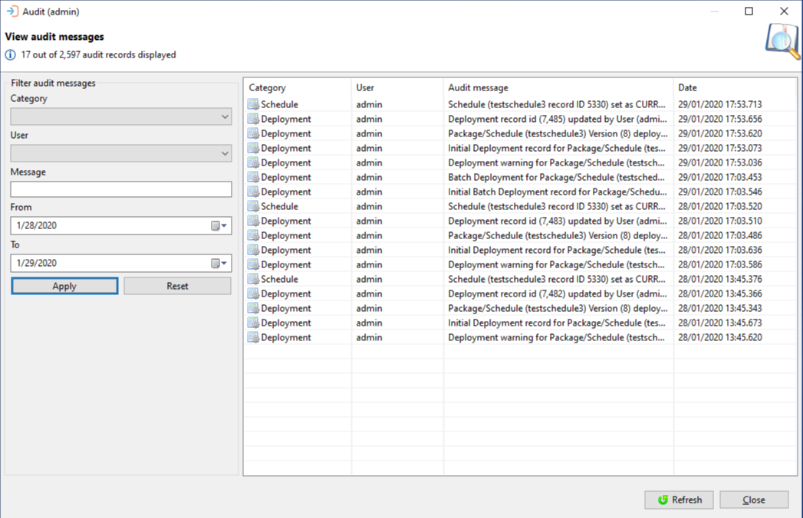

# Audits

**Theme:** Configure  
**Who Is It For?** System Administrator

## What is it?

The Audits function provides query access to the OpCon Deploy audit log, which records every action performed by every user — including imports, deployments, package changes, and server or user management operations. Each entry captures the action category, the user who performed it, a timestamp, and a description of what changed. Administrators can filter the log by category, user, date range, or message content to investigate a specific event or produce an activity report.

When working with the OpCon Deploy, all actions performed by users are audited and entries inserted into the Audit table. The entries consist of an audit category, a timestamp, a description, and the user who performed the action.

The Audit function provides query access to the Audit database table and allows a user who has the Administration role to perform to perform queries on the table. The queries are performed by selecting filters then selecting the Apply button. The filters consist of category, user, a string value, a start date, and an end date.

To update the list of records displayed in the Audit Queries window, Select the **Refresh** button, located in the bottom right corner of the window next to the **Close** button.

## Configuration options

| Filter | What it does | Default | Notes |
|--------|-------------|---------|-------|
| **Category** | Filters the audit log to records from a specific action category | All categories | Valid values: `Deployment`, `Package`, `Schedule`, `Server`, `TransformationRule`, `User`, `GlobalRule` |
| **User** | Filters records to a specific OpCon Deploy user | All users | Enter the exact user name |
| **Message** | Filters records where the audit message contains the entered string | — | Partial string match; not case-sensitive |
| **From** | Start date for the query date range | — | Use MM/DD/YYYY format |
| **To** | End date for the query date range | — | Use MM/DD/YYYY format |
| **Apply** | Submits the query with the selected filter criteria | — | Select after setting filters |
| **Reset** | Clears all filter selections and returns to default values | — | Previously returned records are cleared |

## Key terms

**Audit category** — the classification assigned to each audit log entry that identifies the type of action recorded; valid values are `Deployment`, `Package`, `Schedule`, `Server`, `TransformationRule`, `User`, and `GlobalRule`, and the category filter can be used to narrow query results to a specific area of activity.

**Audit log** — the chronological record in the OpCon Deploy database of every action performed by every user, with each entry storing the category, a timestamp, the name of the user who acted, and a description of what changed; the log is read-only and accessible only to users with the Administration role.

**Related topics:**

- [Users](users)
- [Settings](settings)
