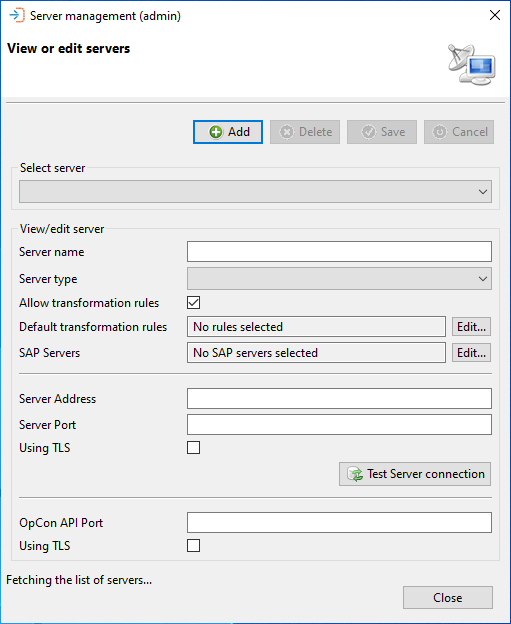
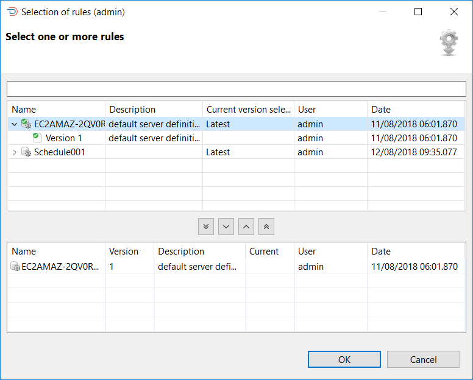
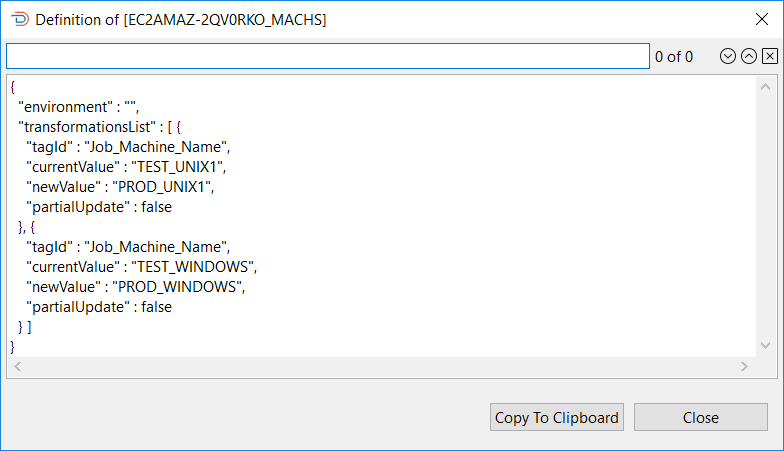
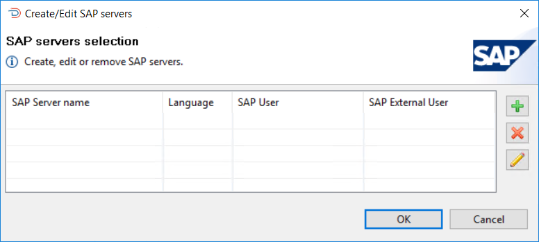
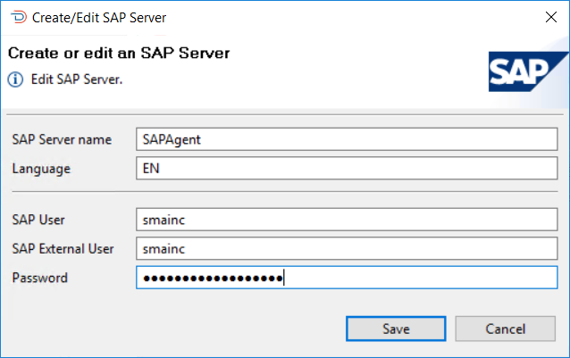

# Servers

**Theme:** Configure  
**Who Is It For?** System Administrator

## What is it?

The Servers function lets you register and manage the OpCon systems that participate in the OpCon Deploy environment. Each server definition stores the connection details needed to reach that system's ImpEx2 RESTful server and OpCon RestAPI, assigns the server a type (such as Development, Test, or Production) that governs who can deploy to it, and optionally attaches default transformation rules that are applied automatically to every deployment targeting that server. A server must be defined here before it can be used as a source for imports or a target for deployments.

When working with the OpCon Deploy, each OpCon system that is used to import schedules from or deploy schedules to must be defined.

Servers are associated with roles that define their capability within the application.

For access to OpCon systems, the server definition contains the information required to connect to the ImpEx2 RESTFul server and the OpCon RestAPI of the OpCon system. The ImpEx2 RESTFul server provides access to the OpCon system while the OpCon RestAPI is used to access specific functions.

If the OpCon system supports SAP agents, the SAP agents must be configured to support the SAP functions to extract SAP job definitions, to link SAP job definitions, and to create SAP job definitions.

The Servers function allows servers to be managed in OpCon Deploy. It is possible to Add, Delete, or Update (Save) server information.

## Select server section

When working with the View or edit servers dialog, the information of an existing server can be displayed by selecting the server from the **Select server** list. Once the server has been selected, the information is displayed in the View/edit server section. Password values are not displayed.

Once the server information has been displayed, the server can be removed from the application by selecting the Delete button. Before deleting the record, a confirmation message will be displayed.

If changes are made to the server information, then the Save and Cancel buttons will be enabled.

## Configuration options

| Field | What it does | Default | Notes |
|-------|-------------|---------|-------|
| **Server Name** | The unique name for this OpCon system within OpCon Deploy | — | Must be unique; this name appears in import and deployment dialogs |
| **Server Type** | Classifies the server as production or non-production, controlling deployment checks and user access | — | Production types: Pre-production, Production, Training. Non-production types: Development, Integration, Quality Assurance, System Test, Test |
| **Allow Transformation Rules** | When selected, transformation rules can be applied to deployments targeting this server | Selected | If cleared, deployments with transformation rules selected will fail when the global **Fail if Transformation Rules Present and Transformation Disabled** rule is enabled |
| **Default Transformation Rules** | A set of transformation rules that are automatically applied to every deployment targeting this server | — | Select using the **Edit** button; rules apply in addition to any deployment-level rules selected at deploy time |
| **Server Address** | IP address or DNS name of the ImpEx2 RESTful server for this OpCon system | — | — |
| **Server Port** (ImpEx2) | Port of the ImpEx2 RESTful server | — | Use `9001` for non-TLS, `9011` for TLS |
| **Using TLS** (ImpEx2) | Indicates whether the ImpEx2 connection uses TLS | — | Must match the ImpEx2 server configuration |
| **OpCon API Port** | Port of the OpCon RestAPI server | `9010` | — |
| **Using TLS** (OpCon API) | Indicates whether the OpCon RestAPI connection uses TLS | — | Must match the OpCon RestAPI server configuration |

### SAP server fields

| Field | What it does | Default | Notes |
|-------|-------------|---------|-------|
| **SAP Server Name** | The name of the SAP R3 Agent on the OpCon system | — | Must match the SAP Agent definition in OpCon |
| **SAP Language** | The language used by the SAP system | — | Examples: `EN` for English, `F` for French |
| **SAP User** | The SAP user with rights to access the SAP system through the XBP interface | — | Must match the user defined in the SAP Agent definition |
| **SAP Password** | The password for the SAP user | — | Enter in plain text; the software encrypts the value before storing it |

When adding default transformation rules to the server, select the Edit button and the **Select one or more rules** dialog will appear.

The Select one or more rules dialog presents a screen and a **Select** capability that allows you to enter a text string in the **Filter** field to retrieve specific transformation rule records or use the displayed default value of asterisk (*) to retrieve all transformation rule records. If there are any records previously entered, they will be displayed in the selection and selected sections of the dialog. Once the text string has been entered select the **Refresh** button and the transformation rule information will be displayed. Subsequent requests will be added to the existing list. The **Clear** button can be used to reset the list of previously selected transformation rules. Transformation rules selected in the lower table, will remain in the upper selection screen after a reset.

Wildcards are not supported. The text entered in the **Filter** field is checked against the transformation rule name in the record — for example, entering `HP` returns all records with that character sequence in the name.

To add a transformation rule, select the rule in the upper table and then select the **Include** button. To remove a transformation rule, select the rule in the lower table and select the **Remove** button.

To view the transformation rule definitions, right-click the definition in the list (upper or lower tables) and select **View Definition** to view the JSON definition, as shown in the Viewing Transformation Rules Definitions from Server graphic.

To search for a value in the JSON, enter the required value in the search field above the definition and select a search direction using the forward or backward buttons. Selecting the X will remove the search result from the definition and the search field.

When adding SAP server definitions to the server, select the Edit button associated with the SAP servers and the SAP servers selection dialog will appear.

To add a new SAP server, select the + button and the Create or edit an SAP Server dialog will appear.

This list contains descriptions of each field in the Create or edit an SAP Server dialog.

### SAP server name

The name of the SAP R3 Agent on the OpCon system

### SAP language

The language used by the SAP system (example **EN** for English, **F** for French)

### SAP user

The name of the SAP user who has the rights to access the SAP system through the XBP interface
* It is the same user defined within the SAP Agent definition

### SAP password

The password of the SAP user
* The password is entered in plain text as the software will encrypt the password value before storing it in the database

## Exception handling

| Error or symptom | Meaning | How to fix it |
|---|---|---|
| Save fails when adding a new server | The server name entered already exists in OpCon Deploy — server names must be unique | Choose a different server name; use the **Select server** list to check which names are already in use |
| Import or deploy operation fails with a connection or license error | The ImpEx2 RESTful server on the source or target OpCon system is unreachable, or the OpCon license on that system does not permit the requested operation | Verify the **Server Address**, **Server Port**, and **Using TLS** settings match the ImpEx2 server configuration; confirm the OpCon system's license is valid and that the ImpEx2 service is running |
| Deployment fails with a transformation rule error on the target server | The target server has **Allow Transformation Rules** cleared, preventing transformation rules from being applied | Enable **Allow Transformation Rules** on the server definition, or remove the transformation rules from the deployment before proceeding |

## FAQs

**What is the difference between a production and a non-production server type?**

The server type controls which deployment checks are applied and which users can target the server. Production types (Pre-production, Production, and Training) trigger a mismatch check during deployment — OpCon Deploy compares the schedule on the target system against the version from the previous deployment record to detect local changes. Non-production types (Development, Integration, Quality Assurance, System Test, and Test) only check whether the schedule already exists on the target, not whether it matches a specific prior version. The server type also determines which user roles can deploy to it: users with the Production role can only deploy to production-type servers.

**Do default transformation rules defined on a server replace the rules selected at deployment time, or do they combine?**

They combine. Server-level default transformation rules are applied in addition to any rules selected at the package or deployment level, not instead of them. The order of application is: server transformation rules first, then package transformation rules, then deployment-specific transformation rules. If a rule at a higher level already transforms a value, a lower-level rule targeting the original value will be ignored, but a lower-level rule can still overlap a value that was introduced by a higher-level rule.

**What port values should I use for the ImpEx2 server connection?**

Use port `9001` for a non-TLS connection and port `9011` for a TLS connection. These are the default values noted in the Server Port field description and in the installation documentation. Ensure the **Using TLS** toggle matches the TLS setting configured on the ImpEx2 server itself.

**Related topics:**

- [Users](users)
- [Settings](settings)
