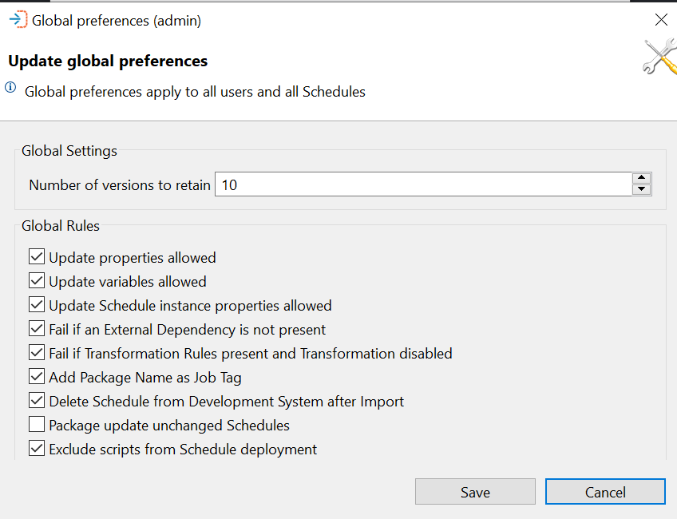

# Settings

When working with OpCon Deploy, it is possible to set some global rules that will override individual user selections. These rules are enabled or disabled by using the Settings function.

## Update Global Preferences

The Global Rules consist of those described in this list.

## Global Settings

### Number of Versions to Retain

This value is used by the archive process and defines the number of versions of the schedule, package, and transformation rules to retain in the main tables.
* If a version is active, it will not be archived.

## Global Rules

### Update Properties Allowed

When this rule is disabled, existing matching global properties encountered during an import process will not be updated. New global properties will be imported and set to the values in the definition.

### Update Variables Allowed

When this rule is disabled, existing matching Resource and Threshold definitions encountered during an import process will not be updated. New Resource and Threshold definitions will be imported and set to the values in the definition.

### Update Schedule Instance Properties Allowed

When this rule is disabled, existing matching Schedule Instance Property definitions encountered during an import process will not be updated. New Schedule Instance Property definitions will be imported and set to the values in the definition.

### Fail if an External Dependency Is Not Present

* When this rule is disabled, if a missing external dependency is encountered during the import process, the error will be logged, and the import will continue.
* If this rule is enabled, the import will stop with an error.

### Fail if Transformation Rules Present and Transformation Disabled

* When this rule is disabled, if a missing external dependency is encountered during the import process, the error will be logged, and the import will continue.
* If this rule is enabled, the import will stop with an error.

### Add Package Name as Job Tag

When this rule is set and a package is deployed, the package name will be added as a Job Tag (user-defined tag).

### Delete Schedule from Development System after Import

If this rule is enabled, the definition will be deleted when a schedule from an OpCon system that has been designated as a Development system is imported into the repository.

### Package update unchanged Schedules

During package deployment, a check is made to see if the schedule version of the target schedule within the package matches the schedule version of the schedule to be deployed. If the versions match, only the schedule deployment information is updated on the target schedule. If this rule is selected, the target schedule contents will be overwritten. 