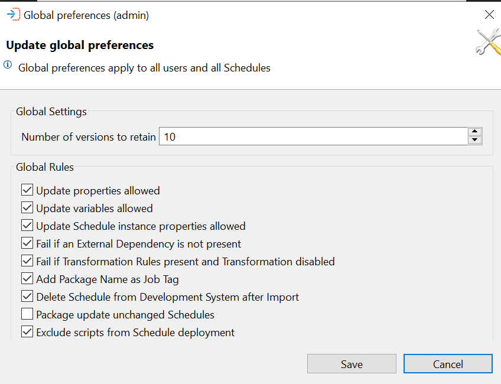

# Settings

**Theme:** Configure  
**Who Is It For?** System Administrator

## What is it?

The Settings function controls the global rules that govern import and deployment behavior across the entire OpCon Deploy environment. These rules apply to all users and override individual selections — for example, preventing existing global properties from being updated during an import, or stopping a deployment if a required external dependency is missing. Changes made here take effect immediately and affect every subsequent import and deployment operation.

Global rules that override individual user selections are enabled or disabled using the Settings function.

## Configuration options

| Setting | What it does | Default | Notes |
|---------|-------------|---------|-------|
| **Number of Versions to Retain** | Defines how many versions of each schedule, package, and transformation rule are kept in the main tables before archiving | 5 | Active versions are never archived regardless of this value |
| **Update Properties Allowed** | When enabled, existing global properties are updated during import to match the imported definition | Enabled | Disable to prevent import from overwriting existing global property values |
| **Update Variables Allowed** | When enabled, existing Resource and Threshold definitions are updated during import | Enabled | Disable to prevent import from overwriting existing resource and threshold values |
| **Update Schedule Instance Properties Allowed** | When enabled, existing Schedule Instance Property definitions are updated during import | Enabled | Disable to prevent import from overwriting existing schedule instance property values |
| **Fail if an External Dependency Is Not Present** | When enabled, the import stops with an error if a missing external dependency is encountered | Disabled | When disabled, the error is logged and the import continues |
| **Fail if Transformation Rules Present and Transformation Disabled** | When enabled, a deployment to a server that does not allow transformation rules will fail if transformation rules are selected | Disabled | When disabled, the deployment proceeds without applying transformation rules |
| **Add Package Name as Job Tag** | When enabled, the package name is added as a user-defined Job Tag on each deployed job | Disabled | Applies during package deployment only |
| **Delete Schedule from Development System after Import** | When enabled, the schedule definition is deleted from the source Development system after a successful import | Disabled | Only applies when importing from a server designated as a Development type |
| **Package update unchanged Schedules** | When enabled, the full schedule contents are overwritten during package deployment even if the schedule version has not changed | Disabled | When disabled, only the deployment information is updated for unchanged schedule versions |
| **Exclude Script from Schedule Deployment** | When enabled, script definitions are not imported or deployed with schedules; scripts must be managed separately using the Scripts menu | Disabled | When using this rule, use 'Latest Version' in embedded script job definitions to avoid version mismatch errors |
| **Exclude Calendars from Schedule Deployment** | When enabled, calendar definitions are not imported or deployed with schedules | Disabled | — |
| **Merge Schedule Instance Properties** | When enabled, new schedule instance properties are merged with existing ones rather than replacing them | Disabled | Only applies when **Update Schedule Instance Properties Allowed** is disabled |
 

## Exception handling

| Error or symptom | Meaning | How to fix it |
|---|---|---|
| Import stops with an error about a missing external dependency | **Fail if an External Dependency Is Not Present** is enabled and the schedule being imported references a dependency (such as a threshold, resource, or external schedule) that does not exist on the target system | Either create the missing dependency on the target OpCon system before importing, or disable **Fail if an External Dependency Is Not Present** so the error is logged and the import continues |
| Deployment fails because transformation rules are present but the server does not allow them | **Fail if Transformation Rules Present and Transformation Disabled** is enabled and the target server has **Allow Transformation Rules** cleared | Enable **Allow Transformation Rules** on the target server definition in Servers, remove the transformation rules from the deployment, or disable the global fail rule |
| Deployment fails because a script, runner, or version cannot be found | **Exclude Script from Schedule Deployment** is active and the embedded script job definition specifies a fixed script version that does not exist on the target system | Set the embedded script job definitions to use **Latest Version** as recommended when the Exclude Script rule is enabled, or deploy the required script separately using the Scripts menu before deploying the schedule |

## Key terms

**Global rule** — a system-wide setting in OpCon Deploy that governs import and deployment behavior for all users; global rules override individual user selections and take effect immediately for every subsequent operation without requiring a restart.

**Exclude Script from Schedule Deployment** — a global rule that, when enabled, prevents script definitions from being imported or deployed alongside schedules so that scripts are managed independently through the Scripts menu; when this rule is active, embedded script job definitions should reference the latest version to avoid version mismatch errors.

**Number of Versions to Retain** — a global rule that sets how many versions of each schedule, package, and transformation rule are kept in the main database tables before the archiving process moves older versions to archive tables; the default value is 5, and active deployment versions are never archived regardless of this setting.

**Related topics:**

- [Database archiving](../database-archiving)
- [Users](users)
