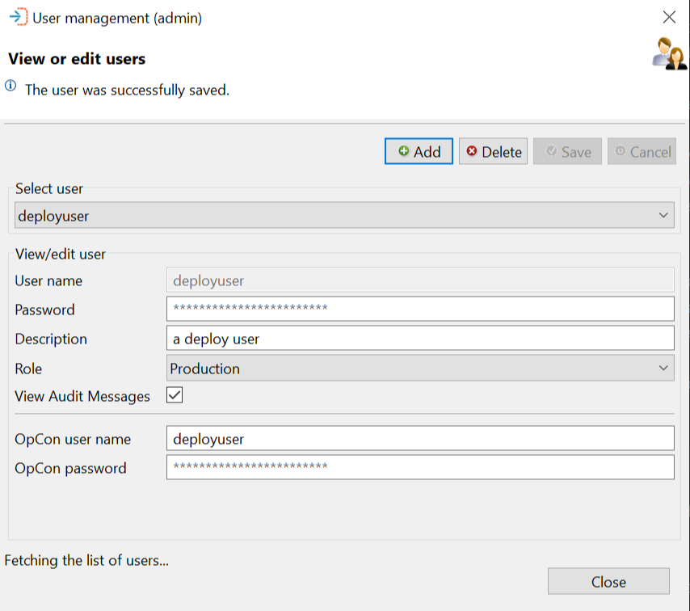

# Users

When working with the OpCon Deploy, users are required as each function performed by the user is audited in the Audited table by category, date and time, and user. Therefore, it is important to allocate individual users instead of using a generic user.

Users are associated with roles that limit their capability within the application.

When entering Windows users, the domain and username should be defined (i.e., domain/username). It is not necessary to enter a password when defining a Windows user.

For access to OpCon systems, the user definition is mapped to an OpCon user. It should be noted that the OpCon user associated with the user definition must be defined on all OpCon systems to which the user has access.

The Users functions allows users to be managed in the OpCon Deploy. It is possible to Add, Delete, or Update (Save) user information.

## Select User Section

When working with the View or edit users dialog, the information of an existing user can be displayed by selecting the user from the Select user drop-down list. Once the user has been selected, the information is displayed in the View/edit user section. Password values are not displayed.

Once the user information has been displayed, the user can be removed from the application by selecting the Delete button. Before deleting the record, a confirmation message will be displayed.

If changes are made to the user information, then the Save and Cancel buttons will be enabled.

## View/Edit User Section

This list contains descriptions of each field in the View/edit user section of the View or edit users dialog.

### User Name

The name of the user
* This must be a unique name within OpCon Deploy.
* If using Windows Authentication, this is the Windows domain/name.

### Password

The user password
* When a user account is being created or edited, the password field will appear with placeholder text that disappears once the user begins typing the password.

:::info Note 

If Windows Authentication is being used, the password field will be disabled.
:::

* A MD5 hash of the user password is stored in the database and it is not possible to decode this value.
* If using Windows Authentication, no password is required.
* If a password is forgotten, a new password should be entered.

### Description

A description associated with the user being defined

### Role

The role of the user
* The role defines the administration, import, and deployment capabilities of the user.
* The major aim of the role currently is to define the deployment capabilities of the user. A user that has a role of Production, may only deploy schedules to a production system.

:::info Note

 Production systems include Pre-Production, Production and Training servers. Test systems include Integration, Quality Assurance, System Test and Test servers. The Non-Production systems are all Development and Test server types.

:::

* Types of roles include:
    * Administration - This role is allowed full access to all functions in the application.
    * All - This role is allowed to import schedules from and deploy schedules to all servers.
    * Production - This role is allowed to import schedules from all Non-Production systems, but only deploy schedules to Production systems.
    * Non-Production - This role is allowed to import schedules from all Non-Production systems, and deploy schedules to Non-Production systems.
    * Development - This role is allowed to import schedules from Development systems and deploy schedules to Development Systems.
    * Test - This role is allowed to import schedules from Test systems and deploy schedules to Test systems.

:::info Note

Admin users may deploy any schedule from the Deploy Schedule screen, but other roles will not be able to select schedules that are being used in a package. Please refer to the Deployments subtopic, [Schedule Deployment](../deployments/#schedule-deployment), for more information.

:::

### View Audit Messages

Checking this box gives the user read-only access to the audit logs.

:::info Note 

The View Audit Messages box is checked by default when opening the User Management screen. Uncheck the box to disallow the user access to the audit logs.

:::

* If the user is an Administrator, this box will be checked and disabled.

### OpCon User Name

The name of a registered OpCon user that will be used when performing schedule Import and Deploy functions

### OpCon Password

The password associated with the OpCon user
* When creating or changing the user password, enter the password in plain text. The software will encrypt the user password using OpCon encryption.

