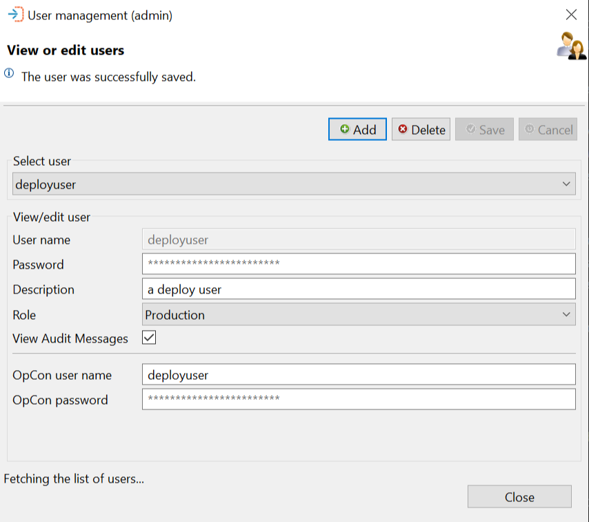

# Users

**Theme:** Configure  
**Who Is It For?** System Administrator

## What is it?

The Users function lets you create and manage the user accounts that control access to OpCon Deploy. Each user is assigned a role that defines which OpCon systems they can import from and deploy to — for example, a Production role restricts a user to deploying only to production systems. Every action performed in OpCon Deploy is recorded in the audit log against the individual user, so assigning unique accounts rather than shared credentials is essential for traceability.

When working with the OpCon Deploy, users are required because each function you perform is audited in the Audited table by category, date and time, and user. Therefore, it is important to allocate individual users instead of using a generic user.

Users are associated with roles that limit their capability within the application.

When entering Windows users, the domain and username should be defined (i.e., domain/username). It is not necessary to enter a password when defining a Windows user.

For access to OpCon systems, the user definition is mapped to an OpCon user. The OpCon user associated with the user definition must be defined on all OpCon systems to which you have access.

The Users functions allows users to be managed in the OpCon Deploy. It is possible to Add, Delete, or Update (Save) user information.

## Select user section

When working with the View or edit users dialog, the information of an existing user can be displayed by selecting from the **Select user** list. Once selected, the information is displayed in the View/edit user section. Password values are not displayed.

Once the user information has been displayed, you can remove the user by selecting the **Delete** button. Before deleting the record, a confirmation message will be displayed.

If changes are made to the user information, then the Save and Cancel buttons will be enabled.

## Configuration options

| Field | What it does | Default | Notes |
|-------|-------------|---------|-------|
| **User Name** | The unique name used to log in to OpCon Deploy | — | For Windows Authentication, enter the Windows domain/name in the format `domain/username` |
| **Password** | The user's login password | — | Stored as an MD5 hash; cannot be decoded. Disabled when Windows Authentication is in use. If forgotten, enter a new password |
| **Description** | Optional free-text description of the user | — | Not required |
| **Role** | Controls which OpCon systems the user can import from and deploy to | — | See role descriptions below. Admin users can deploy any schedule; other roles cannot select schedules assigned to a package |
| **View Audit Messages** | Grants the user read-only access to the audit log | Selected | Automatically selected and disabled for Administrator role users |
| **OpCon User Name** | The OpCon user account used when performing import and deploy operations | — | Must be defined on all OpCon systems the user will access |
| **OpCon Password** | Password for the OpCon user account | — | Enter in plain text; the software encrypts the value using OpCon encryption |

### Role descriptions

:::note
Production systems include Pre-Production, Production and Training servers. Test systems include Integration, Quality Assurance, System Test and Test servers. Non-Production systems are all Development and Test server types.
:::

| Role | Import access | Deploy access |
|------|--------------|---------------|
| **Administration** | All servers | All servers; full access to all application functions |
| **All** | All servers | All servers |
| **Production** | All Non-Production systems | Production systems only |
| **Non-Production** | All Non-Production systems | Non-Production systems only |
| **Development** | Development systems | Development systems |
| **Test** | Test systems | Test systems |

:::note
Admin users may deploy any schedule from the Deploy Schedule screen, but other roles will not be able to select schedules that are being used in a package. For more information, see [Schedule deployment](../deployments/deployments#schedule-deployment).
:::

## Exception handling

| Error or symptom | Meaning | How to fix it |
|---|---|---|
| Save fails when adding a new user | The user name entered already exists in the OpCon Deploy database — user names must be unique | Choose a different user name; use the **Select user** list to check which names are already in use |
| Windows Authentication user cannot log in | The Windows domain/username combination entered in the **User Name** field does not match the authenticated Windows identity, or the format is incorrect | Verify the user name is entered in the `domain/username` format exactly as it appears in Windows; no password is required for Windows Authentication users |
| Import or deploy operation is rejected with a credentials error | The **OpCon User Name** or **OpCon Password** stored in the user definition does not match a valid account on the target OpCon system | Update the **OpCon User Name** and **OpCon Password** fields to match a user defined on every OpCon system the user needs to access, then save the user record |

## FAQs

**What role should I assign to a user who needs to deploy to both test and production systems?**

Assign the **All** role. Users with the All role can import from all servers and deploy to all servers. The Production role restricts deployment to production systems only, and the Non-Production role restricts deployment to non-production systems only. Only the All and Administration roles cover both environments. Note that production system types include Pre-Production, Production, and Training servers, while test systems include Integration, Quality Assurance, System Test, and Test servers.

**How do I reset a user's forgotten password?**

Open the user record in the View or edit users dialog, enter a new password in the **Password** field, and save the record. Passwords are stored as an MD5 hash and cannot be decoded or retrieved, so entering a new value is the only way to reset access.

**Does a Windows Authentication user need an OpCon Deploy password?**

No. When a user is configured for Windows Authentication, the **Password** field is disabled and no OpCon Deploy password is required. The user name must be entered in `domain/username` format. However, the **OpCon Password** field — which stores the credentials used to connect to OpCon systems during import and deploy operations — still applies and must be completed for all user types.

**Related topics:**

- [Servers](servers)
- [Audits](audits)
