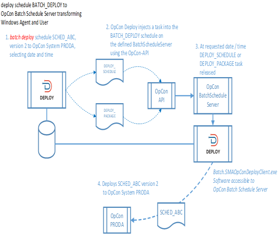
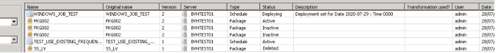
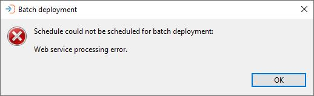
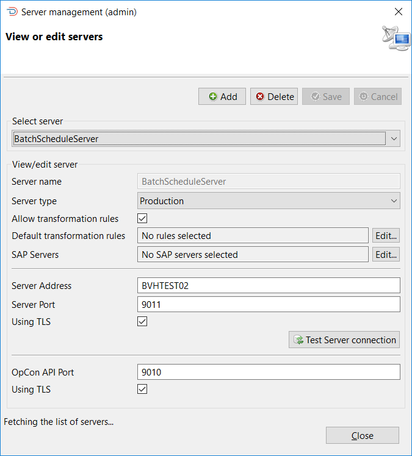

# Batch deployment implementation

**Theme:** Configure  
**Who Is It For?** System Administrator

Batch Deployment is used to deploy a schedule or package at a future date and time. It requires an OpCon system that is used to schedule the deployment at the requested date and time.

The Batch Deploy consists of selecting the schedule or package for deployment, the target OpCon server, and, if required, transformation rules. Once this selection is complete, the Batch Deploy button can be selected, which will then request the date and time of the deployment. You must also enter your OpCon Deploy password.



OpCon Deploy then injects either a ```DEPLOY_SCHEDULE``` or ```DEPLOY_PACKAGE``` job into the ```BATCH_DEPLOY``` schedule using the OpCon RestAPI. If the job is injected correctly into the ```BATCH_DEPLOY``` schedule, a successful completion message is displayed and a record is inserted into the Deployment table, indicating that the schedule or package has been scheduled for future deployment.



The following message will be displayed if OpCon Deploy is unable to schedule the job for future deployment:



:::note "Prerequisites"
The following items must be in place before batch deployment can be used:

* An OpCon system must be identified to schedule the deployment jobs
* Solution Manager must be installed on the identified OpCon system
* OpCon RestAPI must be installed on the identified OpCon system using TLS with an internal certificate
* The Schedule definition ```BATCH_DEPLOY``` must be installed on the system. The schedule is available in the templates (```BATCH_DEPLOY.json```) directory of the client software. The machine name, directory, and the user code that the jobs run under need to be transformed to match the target environment
* The ```BATCH_DEPLOY``` schedule must be available in the daily so the jobs can be added to the schedule (set auto build values as required)
* The OpCon Deploy Client software must be installed on a Windows system that has an associated Windows agent (the installation directory must be transformed to match the environment)
* The jobs ```DEPLOY_SCHEDULE``` and ```DEPLOY_PACKAGE``` definitions should be adjusted to match the Windows system and directories where the OpCon Deploy Client has been installed
* The BatchScheduleServer definition must be updated for the environment
* The config.ini file must be updated to point to the OpCon Deploy database
:::

The database contains a BatchScheduleServer definition that must be modified to point to the OpCon system that will be used to perform the batch scheduling. 

The Server Address field defines the connection to the OpCon RestAPI using TLS (enter port `9011` in the **Server Port** field). 

The definition requires OpCon API Port number (9010) and Using TLS must be selected.



## Exception handling

| Error or symptom | Meaning | How to fix it |
|---|---|---|
| OpCon Deploy displays the deployment scheduling error message and the job is not created | The `BATCH_DEPLOY` schedule is not present in the daily on the batch schedule server, so the `DEPLOY_SCHEDULE` or `DEPLOY_PACKAGE` job cannot be injected via the OpCon RestAPI | Ensure the `BATCH_DEPLOY` schedule has auto build enabled so it is built into the daily; manually build it into the daily for the required date if needed |
| `DEPLOY_SCHEDULE` or `DEPLOY_PACKAGE` job injection fails | The job definitions in the `BATCH_DEPLOY` schedule reference an incorrect machine name, directory, or user code for the target environment, or the OpCon Deploy Client software is not installed on the Windows agent machine | Apply the required transformation rules when deploying `BATCH_DEPLOY` to update the machine name, `SMADeployPath` global property, and Windows user to match the batch schedule server environment |
| Batch deployment scheduling fails with a connection error | The `BatchScheduleServer` definition is missing or configured with incorrect address, port, or TLS settings, preventing OpCon Deploy from reaching the OpCon RestAPI | Update the `BatchScheduleServer` definition to use the correct server address, set the OpCon API Port to `9010`, confirm **Using TLS** is selected, and enter port `9011` in the Server Port field for the ImpEx2 connection |

## Key terms

**Batch deployment** — the process of scheduling a schedule or package deployment to run automatically at a future date and time by injecting a `DEPLOY_SCHEDULE` or `DEPLOY_PACKAGE` job into the `BATCH_DEPLOY` schedule on the designated batch schedule server via the OpCon RestAPI.

**BatchScheduleServer** — the OpCon Deploy server definition that points to the OpCon system responsible for running scheduled batch deployments; it must be configured with the correct RestAPI address, port (9010), and TLS settings before batch deployment can function.

**BATCH_DEPLOY schedule** — the OpCon schedule installed on the batch schedule server that contains the `DEPLOY_SCHEDULE` and `DEPLOY_PACKAGE` job templates; OpCon Deploy injects jobs into this schedule at the requested date and time to carry out future deployments.

**Related topics:**

- [Scheduled batch deployment](scheduled-batch-deployment)
- [Batch processing](batch-processing)
