# Deployments

**Theme:** Build  
**Who Is It For?** Automation Engineer

## What is it?

The Deployments functions support the capabilities required to deploy packages or schedules, view deployment definitions, and perform a rollback of a deployment.

* Deploy a tested schedule or package from the central repository to any registered OpCon system
* Run a simulation first to validate the definition against the target system before committing
* Schedule a deployment to run automatically at a future date and time using the batch deploy option
* Roll back a deployment to restore the previous version if a problem is found after deployment
* Apply transformation rules at deployment time so a single definition serves multiple environments

## Deploy

The deploy function is used to deploy a package or a registered schedule definition within the OpCon Deploy system to a registered OpCon system. During the deploy process, the package version or schedule version is selected from the repository, the target OpCon system is selected, optionally, transformation rules can be selected from the repository, an optional description can be inserted, and the definition is then deployed to the target OpCon system.

Deployment supports backward compatibility between OpCon systems 19.0 and 18.3.x. During the deployment process a check is made to determine if the OpCon versions match. If they do not match, a check is made to see if OpCon 19.0 features are present in the definition. If this is the case, the deployment is stopped with an error message indicating the incompatibility.

You can perform the deployment immediately or schedule it for a future date and time.

As part of the Deploy process, you can also perform a deployment simulation by selecting Simulation instead of Deploy once the selection process is complete. If the simulation completes without any errors, you can continue with the deployment of the package or schedule.

The Deploy process is divided into two distinct phases with the first phase being the selection phase and the second phase being the deployment phase. The deployment phase consists of the deployment check and the deployment phase.

OpCon Deploy requires that each OpCon Deploy system participating in the OpCon Deploy environment requires a license. To enforce this, a check is made to determine if the requested system has a valid OpCon Deploy license. If the system does not have a valid license, the following message will be displayed:

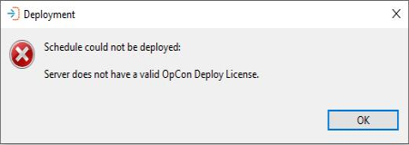

## Deploy selection phase

To start the Deploy process, select the deployments Deploy function. The Select a Deployment type dialog will appear so that the deployment type can be selected (Schedule or Package).

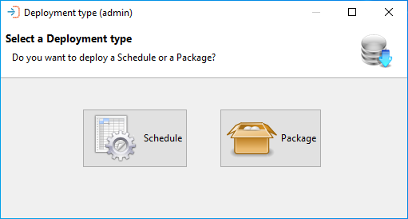

The deployment process begins with the selection of the type of deployment. Following that, various dialogs will be presented leading you through the process.

## Schedule deployment

To deploy a schedule, select the **Schedule** option. The Select a Schedule to deploy dialog appears and you will need to select the schedule definition.

The Select a Schedule to deploy dialog presents a screen and a **Select** capability that allows you to enter a text string to retrieve specific schedule records or use the displayed default value of asterisk (*) to retrieve all schedule records.
Once the text string has been entered select the **Refresh** button and the schedule information will be displayed. Subsequent requests will be added to the existing list. Wildcards are not supported. The text entered in the **Name** field is checked against the schedule name in the record — for example, entering `test` returns all schedule records with that character sequence in the name.

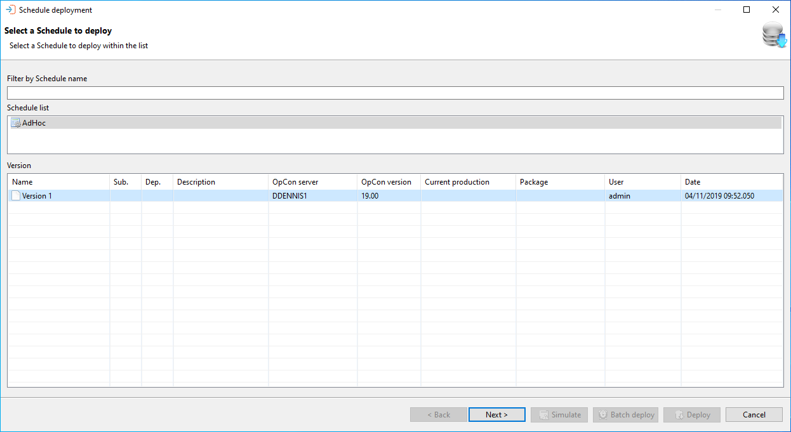

A list of schedule names appears in the upper portion of the dialog. When a schedule is selected, a list of versions available for the schedule appears in the lower table.

Once a schedule has been selected, select the Next button.

:::caution

Once a schedule has been included in a package, it can no longer be deployed as a separate entity. If you have administration privileges, a list of all schedules will be displayed, as there may be exceptional circumstances when a schedule of a package needs to be updated.

:::

Once the schedule has been selected, select the target OpCon system to which the schedule will be deployed. Your user role defines which OpCon systems appear in the list. For example, if your user role is Production, then only Production OpCon systems will appear in the list.

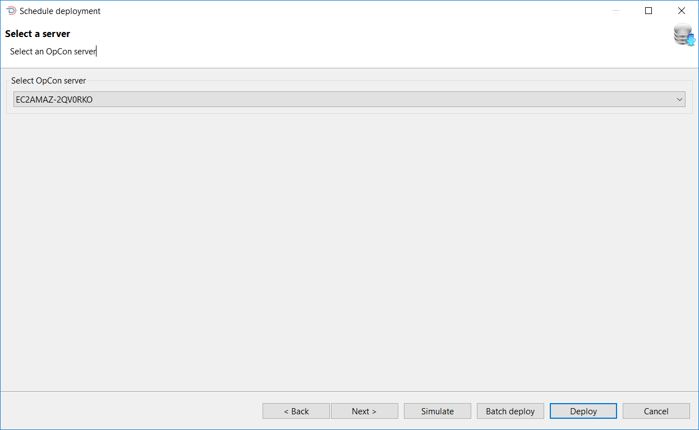

Once a target OpCon system has been selected, you have four options (Next, Simulate, Batch Deploy, or Deploy) to continue the process.

### Deployment server selection dialog options

| Option | Description |
| ------ | ----------- | 
| Next | Select Next if there is a requirement to add transformation rules to the Deployment process |
| Simulate | Select Simulate to perform a deployment simulation, where a check is made to determine if the schedule will deploy without any problems |
| Batch Deploy | Select Batch Deploy to deploy the schedule to the target OpCon system at a future date and time |
| Deploy | Select Deploy to deploy the schedule to the target OpCon system immediately (This is the default option) |

When Next is selected, transformation rules can be added to the deployment process. A set of transformation rules can be added to a server definition to apply them automatically to every deployment targeting that server.

The Select transformation rules dialog presents a screen and a **Select** capability that allows you to enter a text string to retrieve specific transformation rule records or use the displayed default value of asterisk (*) to retrieve all transformation rule records.
Once the text string has been entered select the **Refresh** button and the transformation rule information will be displayed. Subsequent requests will be added to the existing list. Wildcards are not supported. The text entered in the **Name** field is checked against the transformation rule name in the record — for example, entering `test` returns all transformation rule records with that character sequence in the name.

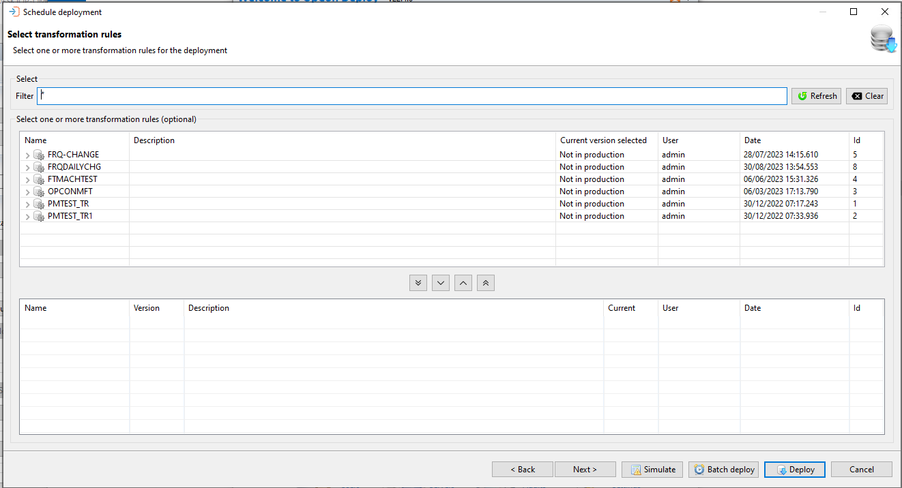

A selection of transformation rules and versions appear in the upper table of the screen. To add a transformation rule, select the rule in the upper table and then select the **Include** button. To remove a transformation rule, select the rule in the lower table and select the **Remove** button.

You can then continue by selecting **Next**, **Simulate**, **Batch Deploy**, or **Deploy**.

### Deploy transformation rule selection dialog options

| Option | Description |
| ------ | ----------- |
| Next | Select Next and the deployment summary screen will be displayed |
| Simulate | Select Simulate to perform a deployment simulation, where a check is made to determine if the schedule will deploy without any problems - The additional transformation rules will be included in this Simulate check |
| Batch Deploy | Select Batch Deploy to deploy the schedule to the target OpCon system at a future date and time |
| Deploy | Select Deploy to deploy the schedule to the target OpCon system immediately (This is the default option) |

When Next is selected, the Summary dialog appears presenting the selections you made. You can add a description to the deployment record, set the schedule auto build options, indicate if any existing schedules in the daily must be rebuilt, and if OpCon SAP R3 jobs are encountered, choose to create the SAP server job definitions. If the option is not selected, the OpCon SAP R3 jobs will be linked with the existing SAP server job definitions.

When setting the auto build options, first select the **Auto Build** option and then set the values for Days In Advance and Days. 
When selecting the **Auto Build** option, the values are initially set to 1. 
When not selected, the Auto Build and Auto Delete settings return to the values currently defined on the schedule imported into OpCon Deploy.

To remove the AutoBuild options, clear the **AutoBuild** option and set the **days in advance for** and **days** to 0.
To remove the AutoDelete option, clear the **AutoDelete** option and set the **days ago** to 0. 

If the requirement is to rebuild the existing schedules in the daily after the schedule definition has been deployed, select the **Rebuild Schedules in Daily** option. When this is selected, all schedules present in the daily from the current date will be rebuilt. During the rebuild process, a check is made to see if the schedules are in an **On-Hold** condition. If the schedule is in an **On-Hold** condition the schedule is rebuilt in that condition. A check is also made to see if the schedule in the daily has any schedule instance properties and if schedule instance properties are present, these values are used during the rebuild process instead of the values from the master.

You can then continue by selecting **Back**, **Simulate**, **Batch Deploy**, or **Deploy**.

### Deployment summary dialog options

| Option | Description |
| ------ | ----------- |
| Back | Select Back and go to previous dialogs to alter selections |
| Simulate | Select Simulate to perform a deployment simulation, where a check is made to determine if the schedule will deploy without any problems - The additional transformation rules will be included in this Simulate check |
| Batch Deploy | Select Batch Deploy to deploy the schedule to the target OpCon system at a future date and time |
| Deploy | Select Deploy to deploy the schedule to the target OpCon system immediately (This is the default option) |

## Machine feature check

If OpCon Deploy is selected, the schedule is then deployed to the target OpCon system. At this point, a check is performed to verify features contained in the deployment match features on a requested machine. If a deployment contains a feature that a requested feature does not have, the deployment will be stopped and Impex will return the following error message:

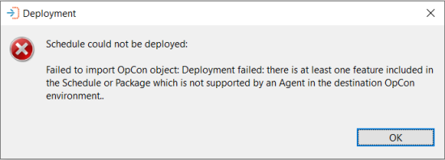

If there are multiple features missing in a machine, each one will now be displayed.

:::note

Since a Batch User ID is required for all jobs, File Watcher v1 is not allowed in OpCon Deploy.

Job Output Parsing v1 and v2 are now treated differently. Job Output Parsing v2 will require v1 to also be present on the machine.

:::

Machine feature checks are also performed during deployment simulations. For more information, see [Simulate deployment](#simulate-deployment).

## Simulate deployment

When simulation is selected and the configuration value **diagramDirectory** is defined, the Deploy definition will be written to this field. This provides a mechanism that allows a visual verification of any transformation rules applied during the deployment.

When Simulate is selected, the following checks are completed for production systems:

* A check is made to see if the existing schedule definition on the target system matches the definition that was saved during the previous deployment process. This is done to see if local changes have been made to the definition since the previous deployment
* A check is done to see if all sub schedules referenced from the new definition are available on the target OpCon system
* A check is done to see if all machines defined in the new schedule definition are available on the target OpCon system
* A check is done to see if all machine groups defined in the new schedule definition are available on the target OpCon system
* A check is done to see if all batch users defined in the new definition are available on the target OpCon system
* A check is done to see if all external dependencies defined in the new definition are available on the target OpCon system
* For Windows jobs, machine features are checked for embedded scripts, file arrival, job output parsing, environmental variables, run in command shell and encrypted token support
* For UNIX jobs, machine features are checked for embedded scripts, file arrival, job output parsing, environmental variables and encrypted token support
* For IBM i jobs, machine features are checked for file arrival

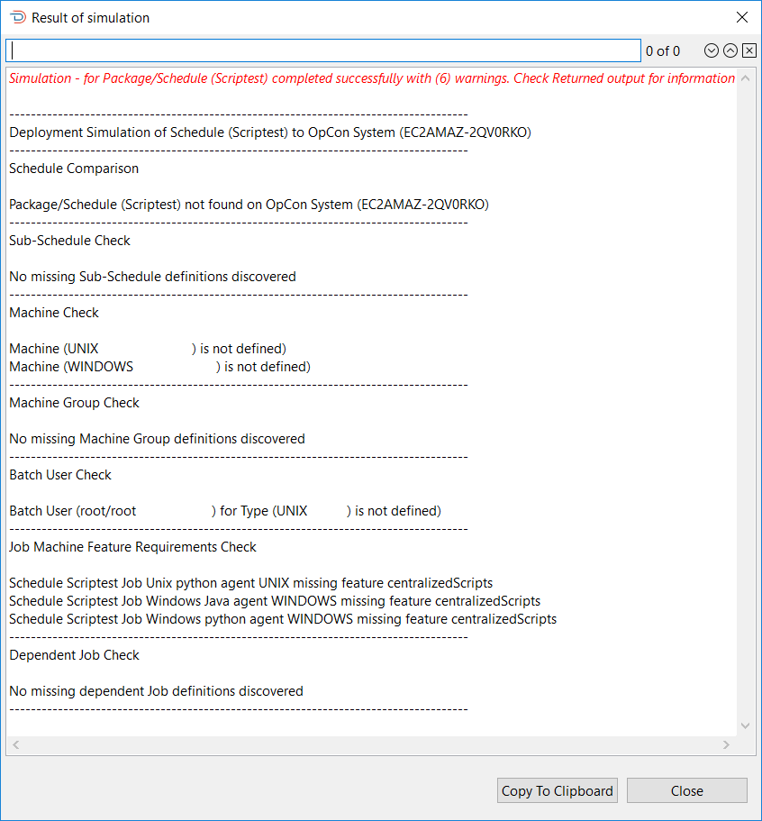

The Sample Simulation Report shows a sample of a Simulate report that contains multiple warnings. When warnings are found during a Simulate process, you cannot deploy the schedule. If no warnings are encountered, a Deploy option will appear next to the Copy To Clipboard option, which can then be used to complete the Deployment process.

## Encrypted tokens

When a schedule containing Windows, UNIX or IBM i jobs with encrypted tokens is selected for deployment, all machines to which these jobs will be deployed are checked to ensure encrypted tokens are supported by the agent. This check is performed when running a simulation of a schedule deployment and the results are included in the Simulation Report when completed. For more information, see the [Simulate Deployment](#simulate-deployment) section.

To verify encrypted token support, perform the process for simulating a deployment. As noted in the Simulate Deployment section, there are multiple checks performed in this process. The simulation verifies that the feature "encryptedTokens.v1" is supported by the agents.

If encrypted tokens are not supported, an error message will be displayed in the report once the simulation has completed.

:::note

The encrypted token support check is only performed during a simulation and is not performed for deployments.

:::

For deployments to a primary machine with alternate machines or a Machine Group, each machine must support encrypted tokens to successfully complete the deployment. Machine selection for the job is set in the Job Details:

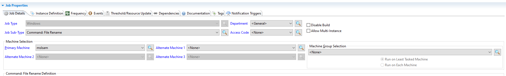

When Batch Deploy is selected, the Batch Deployment dialog will appear. Select a date using the date selector, select a time from the **Time** list, enter your OpCon Deploy password, and select **OK** to submit the request. The **Time** list consists of hourly values from 00:00 to 24:00. The reason that selection from the list must be made is that the time is appended to value DEP-FRQ- to create the required frequency name when performing the job add function.

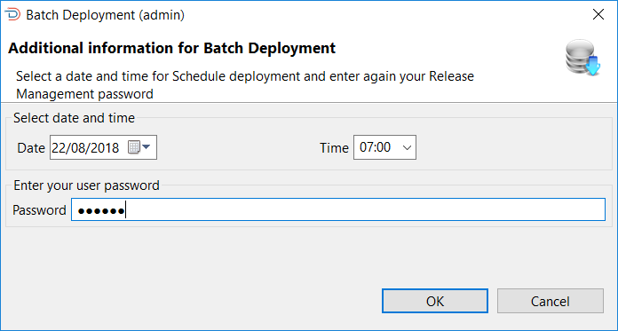

Once OK has been selected, a confirmation message will be displayed asking you to confirm that the deployment must take place.

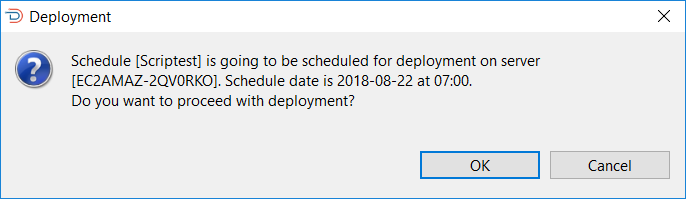

When Deploy is selected, a confirmation message will be displayed asking you to confirm that deployment must take place.

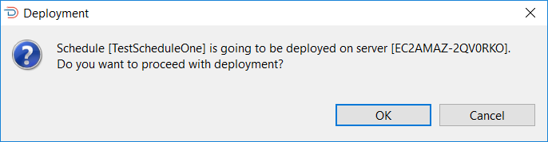

When OK is selected, the deployment check phase commences. During this phase, a check is made to see if a previous deployment of the schedule definition exists on the target OpCon system by retrieving the schedule.

If a previous deployment is found on the target OpCon system, an action is performed depending on the server type.

If the server type is a production server, a check is performed matching the retrieved schedule definition with the value saved in the previous deployment record to determine if there have been any changes made to the schedule definition since the previous schedule deployment. If a mismatch is encountered, a message will be displayed indicating that the deployed schedule definition does not match the previous schedule definition.

Select the **See Differences** button to view the differences, select **No** to abort the deployment, or select **Yes** to continue with the deployment of the new version. Any changes will not be lost, as the retrieved schedule definition is stored in the deployment record and can be referenced.

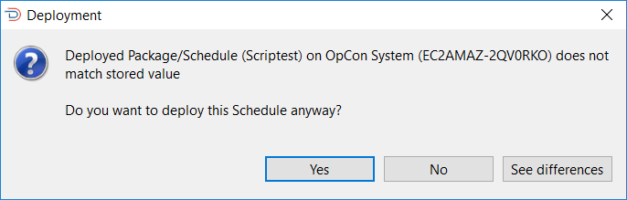

To determine the differences, a JSON compare is performed on the extracted information and the information in the deployment record defined in the deployment information. The path value indicates where the difference is so /scheduleList/0/jobList/0 indicates the first job in the first scheduleList of the JSON definition.

If the server type is a non-production server, a check is performed to see if the schedule definition exists on the target OpCon system. If the schedule definition exists on the system, a message will be displayed indicating that the schedule definition already exists, providing information on when it was deployed and who deployed it. You can abort the deployment or continue with the deployment of the new version. Any changes will not be lost, as the retrieved schedule definition is stored in the deployment record and can be referenced.

During the deployment of a schedule definition to a target OpCon system, deployment information is added to the start of the Schedule documentation field. This contains information about the deployment and should not be changed. During the Deploy Check phase, this information is extracted from the retrieved schedule definition and used to obtain the deployment record from the repository associated with that deployment. If the deployment information is not found, the following error message will be displayed:

Select **No** to abort the deployment and investigate why this information is missing, or select **Yes** to continue with the deployment.

If deployment completes successfully, the following message will be displayed:

If the deployment fails, a message will be displayed indicating why the deployment failed.

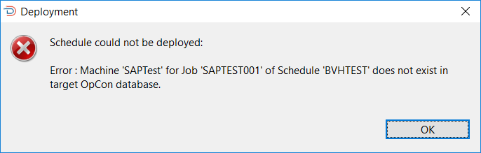

## Package deployment

To deploy a package, select the **Package** option. The Select a Package to deploy dialog appears and you will need to select the package definition.

The Select a Package to deploy dialog presents a screen and a **Select** capability that allows you to enter a text string to retrieve specific package records or use the displayed default value of asterisk (*) to retrieve all package records.
Once the text string has been entered select the **Refresh** button and the package information will be displayed. Subsequent requests will be added to the existing list. Wildcards are not supported. The text entered in the **Name** field is checked against the package name in the record — for example, entering `test` returns all package records with that character sequence in the name.

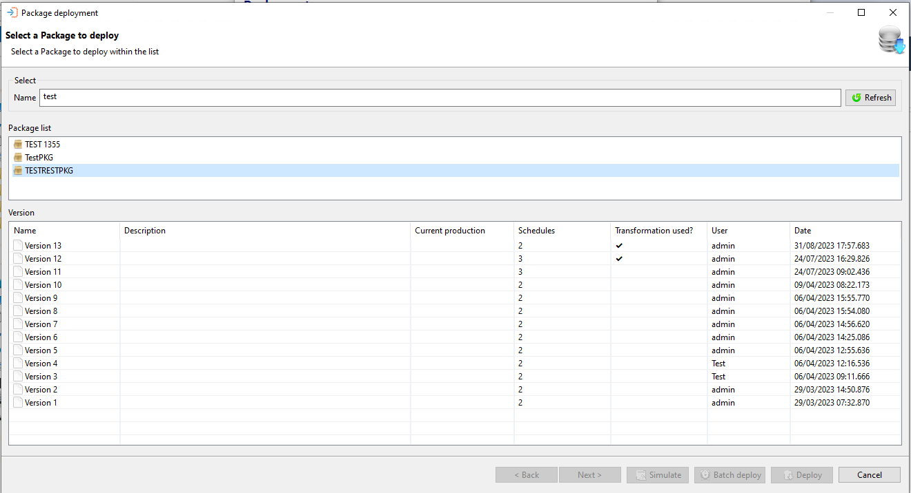

A list of package names appears in the upper portion of the dialog. When a package is selected, a list of versions available for the package appears in the lower table.

Once a package has been selected, select the Next button.

Once the package has been selected, select the target OpCon system to which the package will be deployed. Your user role defines which OpCon systems appear in the list. For example, if your user role is Production, then only Production OpCon systems will appear in the list.

Once a target OpCon system has been selected, you have four options (Next, Simulate, Batch Deploy, or Deploy) to continue the process.

### Deployment server selection dialog options

| Option | Description |
| ------ | ----------- |
| Next | Select Next if there is a requirement to add transformation rules to the deployment process |
| Simulate | Select Simulate to perform a deployment simulation, where a check is made to determine if the package will deploy without any problems |
| Batch Deploy | Select Batch Deploy to deploy the package to the target OpCon system at a future date and time |
| Deploy | Select Deploy to deploy the package to the target OpCon system immediately (This is the default option) |

If the selected server allows transformation rules, select **Next** to select these rules in the dialog screen and apply them to the deployment. If the server does not allow transformation rules, the transformation rules selection dialog screen will be hidden and you should select **Deploy** to begin the deployment process.

:::note

Selecting **Next** when there are no transformation rules selected for the deployment will display the information message "No transformation rules will be applied during this deployment" in the Build options and Summary dialog.

:::

If transformation rules are selected, the result of the deployment depends on the value of the global property setting: "FAIL_IF_TRANSFORMATION_RULES_PRESENT_AND_TRANSFORMATION_DISABLED".

* If False – The deployment will succeed but no transformation rules will be applied. A warning message is displayed on the summary screen: "Transformation rules are not allowed for the selected server. No transformation rules will be applied to this deployment."

* If True – Sending a deployment to this server is not possible. The transformation rules table will appear but the Deploy and Batch Deploy buttons will be disabled since an attempted deployment would fail. An error message will also be displayed: "Transformation rules are not allowed for the selected server. This deployment will fail."

During deployment, once a server that allows transformation rules has been selected, transformation rules can be selected in the Transformation Rules Selection Dialog (seen below). The Build options and Summary screen includes the list of transformation rules that will be applied during the deployment. A set of transformation rules can be added to a server definition to apply them automatically to every deployment targeting that server.

As noted in the [Transformation Rules](../transformations/transformation-rules) topic, the rules are listed in the order of what is applied before initiating deployment. This means the transformation rules will be applied as follows:

* Server Transformation Rules
* Package Transformation Rules
* Deployment Specific Transformation Rules

## Overlapping transformation rules

The order in which transformation rules are applied is important in the event that one rules overlaps another. Following the order in which transformation rules are applied, if a rule is set for a job at the server level, that rule overrides a transformation rule applying to the job at a lower level. For example:

 

* Server Transformation Rule – Replace machine'Test1' with machine 'Test2'
* Package Transformation Rule – Replace machine 'Test1' with machine 'Test3'

The rule at the server level to replace machine Test1 with machine Test2 is accepted and applied to the job, and the rule at the package level to replace Test1 with Test3 will be ignored. But, a transformation rule applied at a lower level may overlap a rule that transformed the job at a higher level. Using the above example, adding a Deployment Transformation Rule:

* Deployment Transformation Rule – Replace machine 'Test2' with machine 'Production'

Now, all jobs which were pointing to machine Test1 or machine Test2 are mapped to Production. The Development Transformation Rule has overlapped the other transformation rules.

Transformation rules may be selected from the window in the Build Options and Summary screen. Selecting a transformation rule from the list opens another window — View Transformation Rules. The fields in this table are not editable:

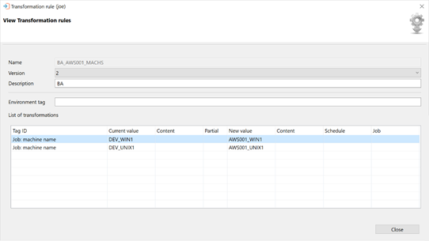

## Exception handling

| Error or symptom | Meaning | How to fix it |
|---|---|---|
| Invalid license message displayed | The target OpCon system does not have a valid OpCon Deploy license | Verify that a valid OpCon Deploy license is installed on the target system |
| Deployment stopped with incompatibility error | The schedule definition contains OpCon 19.0 features and the target system is running OpCon 18.3.x | Deploy to a target system running OpCon 19.0 or greater, or remove the incompatible features from the definition |
| Simulate report shows warnings | Missing machines, agents, batch users, or external dependencies detected on the target system | Resolve each warning listed in the simulate report before proceeding with deployment |

## FAQs

**What does the Simulate option check before a deployment?**

For production systems, Simulate performs the following checks: whether the existing schedule definition on the target matches what was saved during the previous deployment (to detect local changes); whether all sub-schedules referenced in the new definition are present on the target; whether all machines, machine groups, and batch users defined in the new definition exist on the target; whether all external dependencies are available; and, for Windows, UNIX, and IBM i jobs, whether the required machine features — such as embedded scripts, file arrival, job output parsing, and encrypted token support — are present on the relevant agents. If any warnings are found, deployment is blocked until they are resolved.

**What happens if someone made local changes to a schedule on the target system after the last deployment?**

When deploying to a production server, OpCon Deploy compares the schedule definition currently on the target system against the definition saved in the previous deployment record. If a mismatch is found, a message is displayed indicating that the deployed schedule does not match the previous deployment. You can select **See Differences** to review a JSON comparison showing exactly what changed and where. You can then choose to abort the deployment or continue. If you continue, the retrieved definition is stored in the new deployment record so no data is lost.

**Can a batch deploy be cancelled after it has been scheduled?**

Yes. A scheduled batch deployment appears in the Deployment Browser. Batch deployments in progress may be cancelled from that window. However, if a batch deployment is not cancelled after the package it references has been deleted, the Batch Deploy job will fail when the Deploy CLI cannot find the package.

## Key terms

**Deployment** — the process of inserting a schedule definition or package from the central repository into a target OpCon system.

**Simulation** — a deployment check that validates the definition against the target system without making any changes.

**Transformation rule** — a set of rules applied during deployment that modify the schedule definition to match the requirements of the target system.

**Rollback** — the process of restoring a schedule definition on the target system to the version that was backed up during the previous deployment.

**Related topics:**

- [Schedules](../schedules)
- [Packages](../packages)
- [Transformation rules](../transformations/transformation-rules)
- [Deployments — browse](deployments-browse)
