# Transformation Rules Tree

On the right side of the Build Options and Summary table is the Transformation Rules tree, which provides a visual representation of the transformation rules being applied at the time of deployment. The tree also displays the levels at which transformation rules are applied, and is an illustration of how applying a new rule can overlap existing rules.

Here is an example of a Build Options and Summary screen with the created transformation rules listed in the Rules Selection window in the left pane and the rules tree, as they will be applied, in the right window:

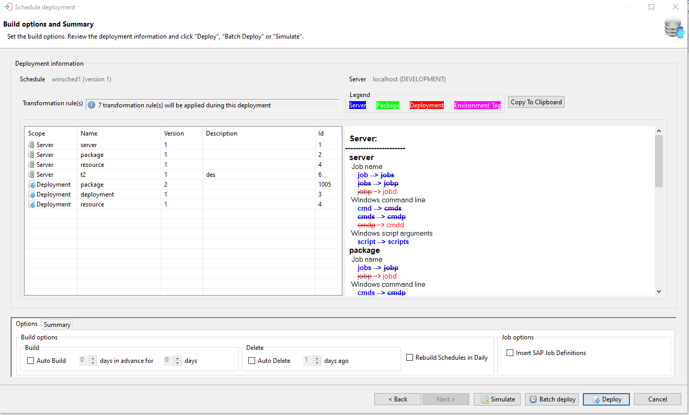

## Rules Selection Window

Once transformation rules have been selected for a deployment, they will be listed in the Rules Selection Window:

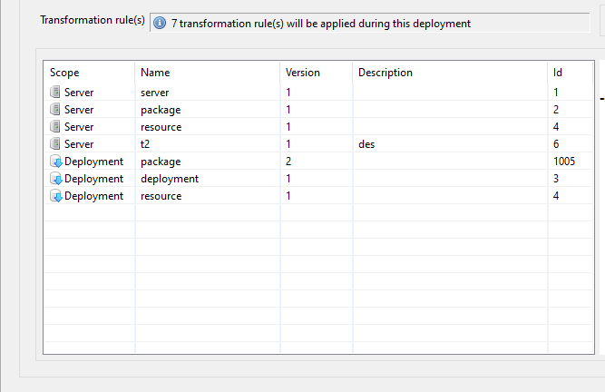

The transformation rules in the list are selectable to view information about each rule. Users may click on a rule to see the new value that will be applied upon deployment and the current value that it is replacing. For example, the first rule listed above is being applied at the Server level. Clicking on the entry opens the information for that transformation rule in a new window:

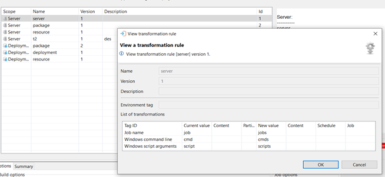 

The transformation window shows the tags that will be changed, listed by Tag ID. The new value of the transformation tag and the current value- the value that it is replacing, is displayed. The first transformation rule listed is applied at the server level, which prioritizes the rules over transformation rules that may be applied at lower levels.

In this example, you have two different transformation rules (i.e., Rule "server" and Rule "package") attached to the same tag ID (i.e., "Job Name"). These rules will relay content from one rule to the other when the rules are applied.

## Relayed Transformation Rules

Relays occur within a transformation tag (in this case Job Name) and can be relayed across several rules. Tags in the transformation rules are applied in the order that they occur. The tags in the selected transformation rules, which are part of the summary page during deployment, can be shown as ignored or applied once, or applied and relayed one or more times.

For example, as part of the server-level transformation rule "server" that is attached to a tag ID "Job Name", a value of "job" is transferred to a value of "jobs". Next, as part of the package-level transformation, for the same tag "Job Name"- the value "jobs" is transformed to value "jobp". The transfer of the value from job --> jobs --> jobp is a relayed transformation rule.

Using this example, under the server level rule for this deployment, there are three tags that will be applied:

* Job name
* Windows command line
* Windows script arguments

If the current value for Job name is 'job', then the new value after the deployment will be 'jobs'. Generally, the rules will be applied to all 'jobs' values, and all those that are matched will be transformed.

In the corresponding transformation rules tree, these rules are listed as they are applied and color-coded based on server, package, deployment, and environment tag:

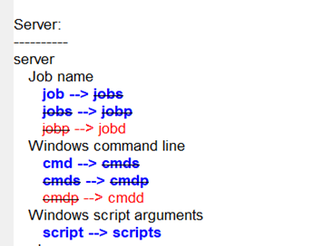 

For the first tag, 'Job name', under the transformation rule named 'Server', there are two relays being applied. One at the job level (shown in blue) and one at the deployment level (indicated in red). For this tag, there are no package relays.

Similarly, for the Windows command line tag, two relays are applicable.

For the last tag in the group, there is one rule applied at the server level and there are no package or deployment relays.

In the next example, the second rule on the list is named 'Package' and is applied at the Server level:

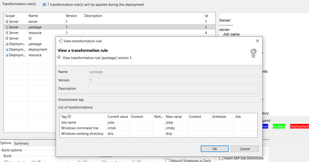

This rule will have three tags applied. These tags are listed in the transformation tree for this rule. The 'Job name' tag will be relayed once by a deployment level rule. Similarly, the tags 'Windows command line' and 'Windows working directory' are relayed by this rule.

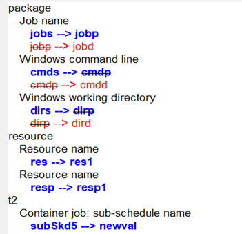

:::info Note

In the example, under the transformation rule 'resource', there are two tags present. But, these tags are not relayed by the server, package, or deployment rules and will only be applied as needed.

:::

Here, under the deployment rules section, the transformation rule 'package' is shown:

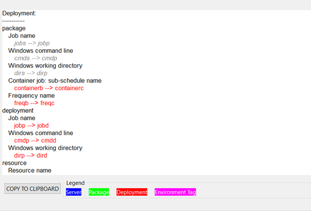

Under this rule, there are five tags listed: Job name, Windows command line, Windows working directory, Container job: sub-schedule name, and Frequency name.

The last two tags, Container job: sub-schedule name and Frequency name are applied as deployment level rules.

The grayed out rules displayed refer to ignored transformations. They are being skipped because a previously applied rule has already transformed the tag item from the same current value to a new value. This results in the candidate tag item not having the current value at the time of transformation.

In the next example, there is a Package Deployment being performed, which includes transformation rules being applied at the package level during a deployment:

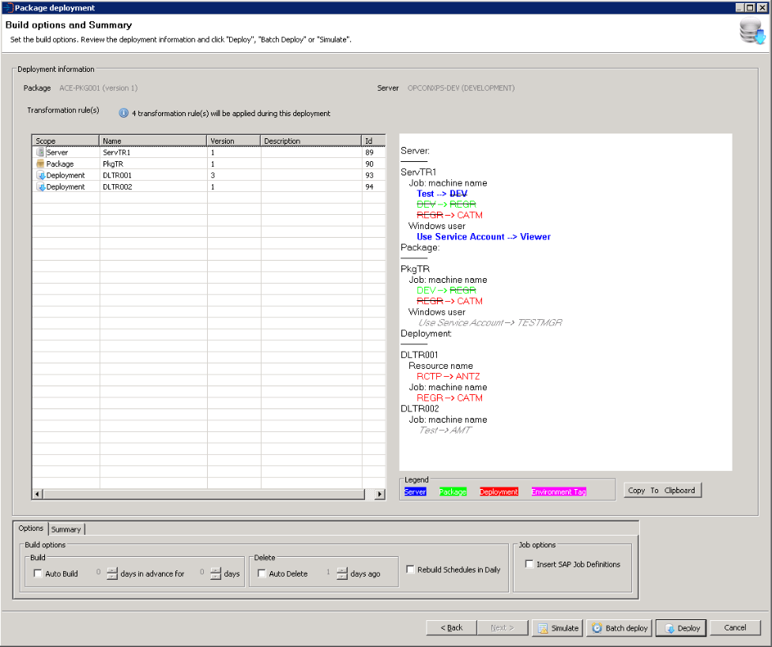

There is one server, one package and two deployment level rules being applied. Just like with schedule deployments, the tags that have been applied at the server level supersede those that have been added to a rule at a lower level.

For example, the transformation of the "*Windows user*" tag in the ServTR1 transformation rule containing the value "*Use Service Account*", transforms to the value of "Viewer" and supersedes the PkgTR rule transformation for the tag with the same original value of "Use Service Account".

Once transformation rules have been selected for a deployment, it is then possible to continue by selecting the Next, Simulate, Batch Deploy, or Deploy option.

### Deployment Transformation Rule Selection Options

| Option | Description |
| ------ | ----------- |
| Next | Select Next and the deployment summary screen will be displayed |
| Simulate | Select Simulate to perform a deployment simulation, where a check is made to determine if the package will deploy without any problems - The additional transformation rules will be included in this Simulate check |
| Batch Deploy | Select Batch Deploy to deploy the package to the target OpCon system at a future date and time |
| Deploy | Select Deploy to deploy the package to the target OpCon system immediately (This is the default option) |

When Next is selected, the Summary dialog appears presenting the sections the user made. It is possible to add a description that will be included in the deployment record, to set the schedule auto build options, to indicate if any existing schedules in the daily must be rebuilt, and if OpCon SAP R3 jobs are encountered, to create the SAP server job definitions. If the checkbox is not selected, then the OpCon SAP R3 jobs will be linked with the existing SAP server job definitions.

When Next is selected, the Summary dialog appears presenting the sections the user made. It is possible to add a description that will be included in the deployment record, to set the schedule auto build options, to indicate if any existing schedules in the daily must be rebuilt, and if OpCon SAP R3 jobs are encountered, to create the SAP server job definitions. If the checkbox is not selected, then the OpCon SAP R3 jobs will be linked with the existing SAP server job definitions.

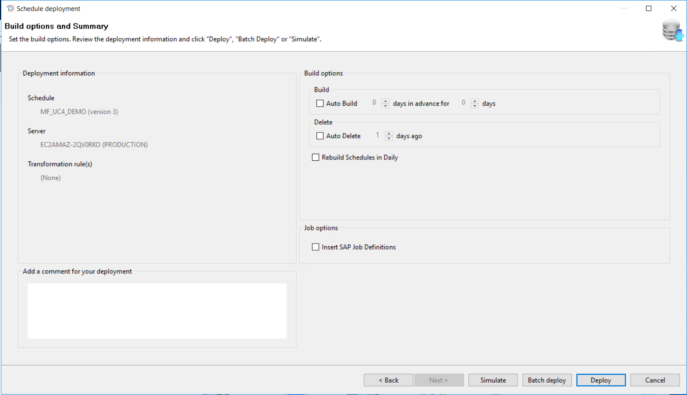

When setting the auto build options, first select the Auto Build checkbox and then set the values for Days In Advance and Days. When selecting the Auto Build checkbox, the values are initially set to 1. When not selected, the values are set to 0.

If the requirement is to rebuild the existing schedules in the daily after the schedule definition has been deployed, select the Rebuild Schedules in Daily checkbox. When this is selected, all schedules present in the daily from the current date will be rebuilt. During the rebuild process, a check is made to see if the schedules are in an On-Hold condition. If the schedule is in an On-Hold condition the schedule is rebuilt in that condition. A check is also made to see if the schedule in the daily has any schedule instance properties and if schedule instance properties are present, these values are used during the rebuild process instead of the values from the master.

It is then possible to continue by selecting the Back, Simulate, Batch Deploy, or Deploy option.

### Deployment Summary Dialog Options

| Option | Description |
| ------ | ----------- |
| Back | Select Back and go to previous dialogs to alter selections |
| Simulate | Select Simulate to perform a deployment simulation, where a check is made to determine if the package will deploy without any problems - The additional transformation rules will be included in this Simulate check |
| Batch Deploy | Select Batch Deploy to deploy the package to the target OpCon system at a future date and time |
| Deploy | Select Deploy to deploy the package to the target OpCon system immediately (This is the default option) |

When Simulate is selected, for production systems the following checks are completed:

* A check is made to see if the existing schedule definitions of the package on the target system matches the definition that was saved during the previous deployment process. This is done to see if local changes have been made to the definition since the previous deployment.
* A check is done to see if all sub schedules referenced from the new definition are available on the target OpCon system.
* A check is done to see if all machines defined in the new schedule definition are available on the target OpCon system.
* A check is done to see if all machine groups defined in the new schedule definition are available on the target OpCon system.
* A check is done to see if all batch users defined in the new definition are available on the target OpCon system.
* A check is done to see if all external dependencies defined in the new definition are available on the target OpCon system.
* If UNIX embedded scripts or file arrival jobs encountered, the features of the target UNIX agent are checked.
* If Windows embedded scripts, file arrival, or run in command shell encountered, the features of the target Windows agent are checked.

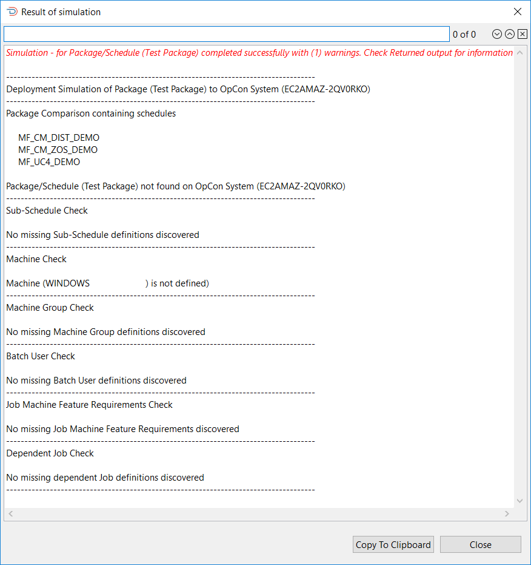

The Sample Simulate Report graphic shows a sample of a Simulate report that contains one warning. It should be noted that the list of schedules that are checked are included in the package simulation report. When warnings are found during a Simulate process, it will not be possible to deploy the package. If no warnings are encountered, a Deploy option will appear next to the Copy To Clipboard option, which can then be used to complete the Deployment process.

When Deploy is selected, a confirmation message will be displayed requesting the user to confirm that deployment must take place.

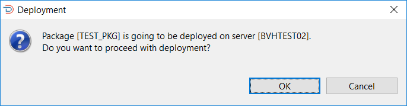

When OK is selected, the deployment check phase commences. During this phase, a check is made to see if a previous deployment of the package definition exists on the target OpCon system by retrieving the schedules associated with the package.

If a previous deployment is found on the target OpCon system, an action is performed depending on the server type.

If the server type is a production server, a check is performed matching the retrieved schedule definitions with the value saved in the previous deployment record to determine if there have been any changes made to the schedule definitions since the previous package deployment. If a mismatch is encountered, a message will be displayed informing the user that the deployed package definition does not match the previous package definition.

The user has the option to see the differences by selecting the See differences button, deployment, to abort the deployment by selecting the No button or continue with the deployment of the new version by selecting the Yes button. It should be noted that any changes will not be lost as the retrieved schedule definition is stored in the deployment record and can be referenced.

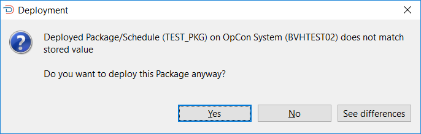

To determine the differences, a JSON compare is performed on the extracted information and the information in the deployment record defined in the deployment information. The path value indicates where the difference is so /scheduleList/0/jobList/0 indicates the first job in the first scheduleList of the JSON definition.

If the server type is a non-production server, a check is performed to see if the schedule definitions exists on the target OpCon system. If any of the schedule definitions exist on the system, a message will be displayed informing the user that the package already exists providing information on when it was deployed and who deployed it. The user has the option to abort the deployment so that it can be determined if the deployment should go ahead or continue with the deployment of the new version. It should be noted that any changes will not be lost as the retrieved schedule definitions are stored in the deployment record and can be referenced.

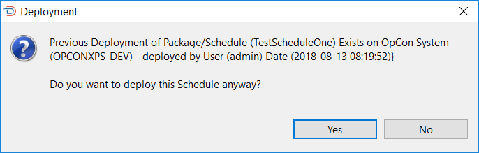

During the deployment of a package to a target OpCon system, deployment information is added to the start of the Schedule documentation field in each schedule associated with the package. This contains information about the deployment and should not be changed. During the Deploy Check phase, this information is extracted from the retrieved schedule definition and used to obtain the deployment record from the repository associated with that deployment. If the deployment information is not found, the following error message will be displayed:

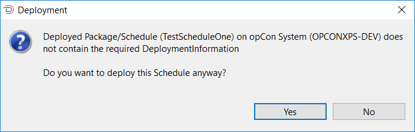

The user has the option to abort the deployment and check why this information is missing or continue with the deployment.

If deployment completes successfully, the following message will be displayed:

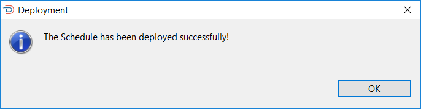
 
 

