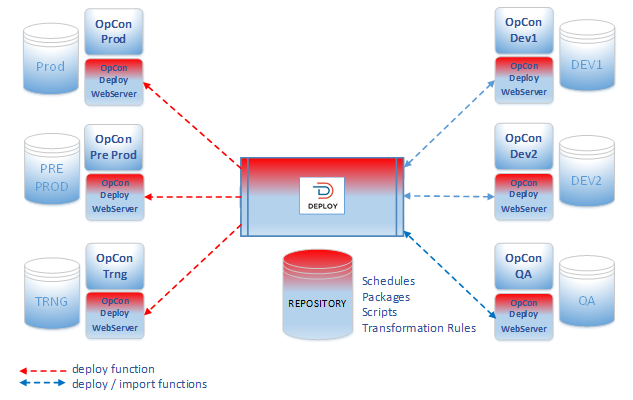
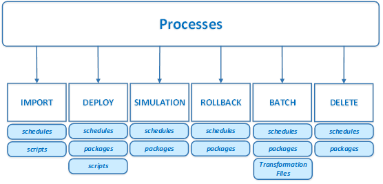

# Getting started

**Theme:** Overview  
**Who Is It For?** System Administrator, Automation Engineer

## What is it?

OpCon Deploy is a separate application working on a central repository that contains schedule definitions, transformation rules, and all the required configuration information to deploy schedule definitions between OpCon environments in a controlled and consistent manner.

* Move schedule definitions through a development-to-production pipeline across multiple OpCon systems
* Maintain version history for every schedule — no definition is ever overwritten, and previous versions can be restored
* Apply transformation rules so a single definition can be deployed to multiple environments without duplication
* Audit all deployment activity to meet the traceability requirements of regulated environments
* Control who can deploy to which systems using server and user role definitions

## Overview

When implementing OpCon Deploy, the schedule definitions must be imported into the central repository before they can be deployed to OpCon systems within the environment. When a schedule definition is imported into the central repository and an entry for the schedule definition already exists, a new version of the schedule definition is created. This means older versions of the schedule definition can be deployed, because a definition is never updated in the repository.

The objective is never to update the schedule definitions directly on production OpCon systems, but rather to deploy the schedule definition to a development system, make and test the changes, then import a new schedule definition to create a new version and then deploy the new version to the running OpCon system.

To communicate with OpCon systems, user and server definitions are required. Each OpCon Deploy user is mapped to an OpCon user and the OpCon Deploy server is mapped to an OpCon system. User roles define the capabilities of the user within OpCon Deploy and Server roles define the capabilities of the OpCon systems.

All actions performed within OpCon Deploy are audited, so you can determine who did what and when by examining the audit records.

## Processes

The OpCon Deploy system provides the following processes:

### Import

The import process consists of extracting a schedule definition from the source OpCon environment and storing it in the central repository for future deployment.

If the schedule definition exists in the central repository, a new version is created.

### Deploy

The Deploy process consists of selecting a schedule definition from the central repository and inserting it into the selected target OpCon environment.

During the deployment process, you can transform the schedule definition using Transformation Rules. This allows a single schedule definition to be deployed to multiple OpCon systems instead of creating a schedule definition for each target OpCon system.

During the deployment process if the target system is defined as a Production system, a check is performed to determine if the definition on the system matches the definition that was deployed. For other systems, a check is made to see if the schedule definition exists on the target system.

You can also deploy a package, which consists of a set of schedules that are deployed and managed in a consistent manner.

### Simulation

The simulation process performs a deployment check without updating the schedule definition on the target OpCon system.

### Rollback

The rollback process performs a restore of a schedule definition from the backup taken during the deploy process.

### Batch

The batch process provides the capability to deploy or simulate deployments of schedules or packages at specific times or perform individual or mass imports of schedule definitions.

### Delete

The delete process removes a package or schedule from the selected OpCon system.

## Key terms

**Central repository** — the OpCon Deploy database that stores all schedule definitions, transformation rules, and configuration information.

**Import** — the process of extracting a schedule definition from a source OpCon system and storing it in the central repository.

**Transformation rule** — a set of rules that modify a schedule definition during deployment to match the requirements of a specific target OpCon system.

**Version** — a numbered snapshot of a schedule definition stored in the central repository. A new version is created each time a definition is imported.

**Related topics:**

- [Installation](installation)
- [User interface](user-interface)
- [Using OpCon Deploy](using-opcon-deploy)
