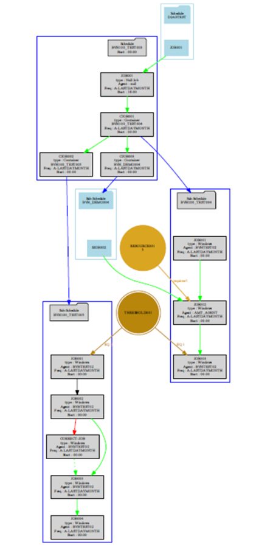
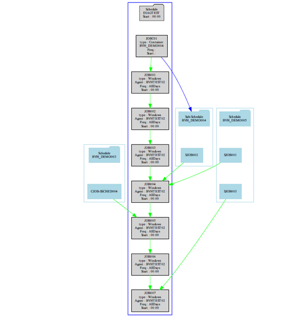
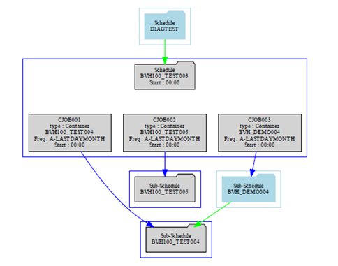

# Package and Schedule Diagram

When creating the diagram, the software uses the schedule definitions and creates a graphic file that is read by the GraphViz Dot.exe processor to produce a PDF document. When a package is selected, the software merges the schedule definitions to create the package and then creates a drawing from the package.

When creating a diagram from a package, it is possible to select either the complete diagram or a diagram containing only schedule headers.

When creating a diagram from a schedule, it is only possible to create the complete diagram.

## Complete Diagram

The complete diagram provides the following:

* A diagram label containing the schedule or package name and the version.
* A schedule is created in a 'blue' box containing the jobs and the schedule name. The schedule information is displayed in a gray 'folder' shape and contain the schedule type (either Schedule or Sub-Schedule), the schedule name, and the schedule start time.
* The job definitions are shown in a 'gray' box shape and show the job name, the type of job, the name of the agent or agent group that the job is associated with, the frequency names, and the start times (if the job start time is 00:00, the schedule start time will be displayed).
* Container jobs are shown in a 'gray' box shape and show the job name, the job type Container, the associated sub-schedule name, the frequency names, and the start time (if the job start time is 00:00, the schedule start time will be displayed). A 'blue' line connects the container job to the associated sub-schedule folder shape.
* If a container job references a sub-schedule that is not part of the extracted definitions, the sub-schedule will appear in a 'light blue' box with the schedule name and schedule type Sub-Schedule appearing in a 'light blue' folder shape. A ‘blue’ line connects the container job to the associated sub-schedule folder shape.
* If resource dependencies are contained in the definitions, the resource is displayed in a 'light gold' circle showing name and number of resources and linked to the job showing the number of resources that the job requires.
* If threshold dependencies are contained in the definitions, the threshold is displayed in a 'gold' circle with a white outer ring showing name and linked to the job showing the threshold dependency value that the job requires.

* Dependencies are shown as follows:
    * Required dependency shown by a 'green' line.
    * After dependency shown by a dotted 'green' line.
    * Ignore Error Code dependency is shown by a 'black' line.
    * Failed dependency shown by a 'red' line.

* Dependencies are shown between jobs in different schedules.

* Dependencies on jobs that are not present in the extracted definitions are shown in a ‘light blue’ box that includes the schedule name and type in a ‘light blue’ folder shape. The job is shown as a ‘light blue’ box shape with the job name.

The figure, "Complete Package Diagram Example" (seen below), shows an example of a full package diagram that shows the capabilities provided by the Package and Schedule Diagram capability.

It shows a schedule that references three sub-schedules. All schedule definitions are surrounded by a ‘blue’ box containing a ‘gray’ folder shape indicating the schedule type, the schedule name, and the start time if the schedule is not a sub-schedule.

The job definitions are shown in ‘gray’ box shapes and contain the job name, the type of job, the agent or agent group, the frequencies, and start times associated with the job.

If the job is a container job, the sub-schedule name is included and a ‘blue’ line links the container job to the folder shape of the associated sub-schedule definition. If the sub-schedule is not part of the extracted definitions, a ‘light blue’ box with a ‘light blue’ folder shape containing the schedule type Sub-Schedule and the schedule name will be created. A ‘blue’ line links the container job to the folder shape of the external sub-schedule.

Job dependencies are indicated by the various color pointers. If a job is dependent on a job in a schedule not part of the extracted definitions, the external job appears in a ‘light blue’ box that includes the schedule name and type in a ‘light blue’ folder shape. The job is shown as a ‘light blue’ box shape with the job name.

The diagram also shows resource and threshold dependencies and indicates the dependency requirement on the pointer.

The next figure, Schedule Diagram, shows an example of a schedule diagram that shows the capabilities provided by the Schedule Diagram capability.

It shows a schedule that references one sub-schedule and external dependencies to multiple schedules including the sub-schedule which is referenced by the container job. The schedule definition is surrounded by a 'blue' box containing a 'gray' folder shape indicating the schedule type, the schedule name, and the start time if the schedule is not a sub-schedule.

The job definitions are shown in 'gray' box shapes and contain the job name, the type of job, the agent or agent group, the frequencies, and start times associated with the job.

If the job is a container job, the sub-schedule name is included and a 'blue' line links the container job to the folder shape of the associated sub-schedule definition. If the sub-schedule is not part of the extracted definitions, a 'light blue' box with a 'light blue' folder shape containing the schedule type Sub-Schedule and the schedule name will be created. A 'blue' line links the container job to the folder shape of the external sub-schedule.

Job dependencies are indicated by the various color pointers. If a job is dependent on a job in a schedule not part of the extracted definitions, the external job appears in a light blue box that includes the schedule name and type in a light blue' folder shape. The job is shown as a light blue' box shape with the job name.

## Header Diagram

The header diagram is only available when a package is selected and provides the following:

* A diagram label containing the package name and the version.
* A schedule is created in a ‘blue’ box containing the container jobs and the schedule name. The schedule information is displayed in a gray ‘folder’ shape and contains the schedule type (either Schedule or Sub-Schedule), the schedule name, and the schedule start time.
* Container jobs are shown in a ‘gray’ box shape and show the job name, the job type Container, the associated sub-schedule name, the frequency names, and the start time (if the job start time is 00:00, the schedule start time will be displayed). A ‘blue’ line connects the container job to the associated sub-schedule folder shape.
* If a container job references a sub-schedule that is not part of the extracted definitions, the sub-schedule will appear in a ‘light blue’ box with the schedule name and schedule type Sub-Schedule appearing in a ‘light blue’ folder shape. A ‘blue’ line connects the container job to the associated sub-schedule folder shape.
* If there are dependencies between jobs in the associated schedules, the dependencies are shown by a line between the schedule folder shapes.
* If there are dependencies between jobs in the schedules and jobs in external schedules, the schedule will appear in a ‘light blue’ box with the schedule name and schedule type Schedule appearing in a ‘light blue’ folder shape. The dependencies are shown by a line between the schedule folder shapes.

