# Packages

**Theme:** Build  
**Who Is It For?** Automation Engineer

## What is it?

A package is a group of schedule definitions that can be deployed together as a single versioned unit to an OpCon system. Once a schedule is included in a package, it cannot be deployed independently to a production system.

* Deploy multiple related schedules together to prevent version mismatches between schedules that depend on each other
* Track the entire package deployment as a single record, simplifying audit and rollback
* Ensure a schedule that belongs to a larger deployment pipeline is always deployed in context, never in isolation

## Manage

The Manage function allows packages to be managed in the OpCon Deploy system. You can add or update (save) package information.

TheView or Edit Packages dialog presents a screen and a **Select** capability that allows you to enter a text string in the **Filter** field to retrieve specific package records or use the displayed default value of asterisk (*) to retrieve all package records.
Once the text string has been entered select the **Refresh** button and the package information will be displayed. Subsequent requests will result in the new selection being displayed. 

Wildcards are not supported. The text entered in the **Filter** field is checked against the package name in the record — for example, entering `GV` returns all package records with that character sequence in the name.

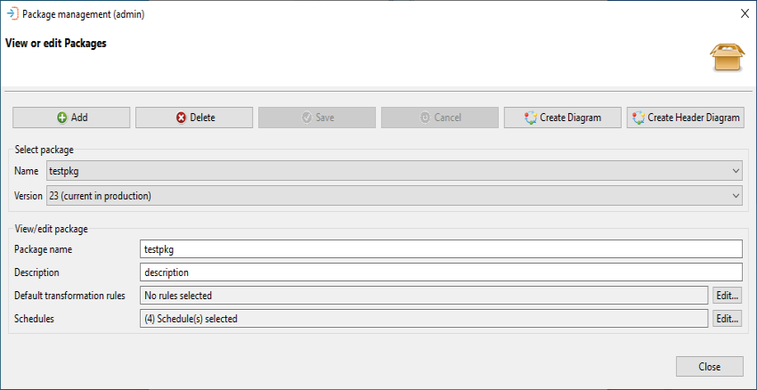

### Select package section

When working with the View or edit Packages dialog, the information of an existing package can be displayed by selecting the package from the **Name** list. Once the package name has been selected, a list of versions of the package will appear in the **Version** list. If the package is deployed to production, the version that is deployed to production will be indicated on the list. When a version has been selected, the information is displayed in the View/edit package section of the dialog.

When a package is selected, the Create Diagram, the Create Header Diagram and the Update Schedule Versions buttons are activated, allowing you to create a diagram from the package definition or update the schedule version of all schedules associated with the package to the latest version in the Deploy database. When a diagram has been selected, it is displayed in PDF format.

The Create Diagram button creates a complete diagram of the schedules, including: jobs, resources, and dependencies. The Create Header Diagram button creates a diagram which displays the schedule header with container jobs only. If job dependencies exist between the jobs on the schedules, these dependencies will be displayed. For more information, see [Package and schedule diagram](package-and-schedule-diagram).

If changes are made to the package information, then the Save and Cancel buttons will be enabled.

Updating the Schedule Versions of a package

Selecting the **Update Schedule Versions** button will bring up the Update Schedule Versions confirmation message:

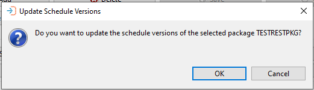

Confirming the message will update the version of schedules associated with the package to the latest version of the schedule in the Deploy database. If the schedule version is the already the latest version, no changes are made.

A completion message is displayed in the upper message bar.

If changes have been made, the Save and Cancel buttons will be enabled. To save the changes and create a new package version, select the **Save** button.

Deleting a Package

Selecting the **Delete** button to delete a package will bring up the Delete Package confirmation message:

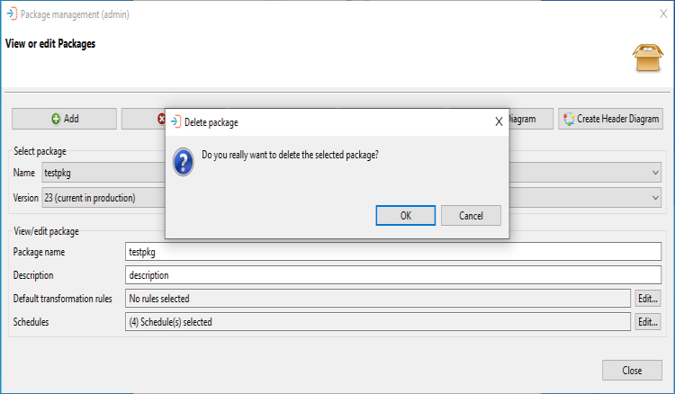

Return to the View or Edit Packages screen by selecting Cancel.

If a user wants to continue with deleting a package and the package selected has versions in production, a secondary confirmation message will prompt you to cross-reference with active packages and schedules:

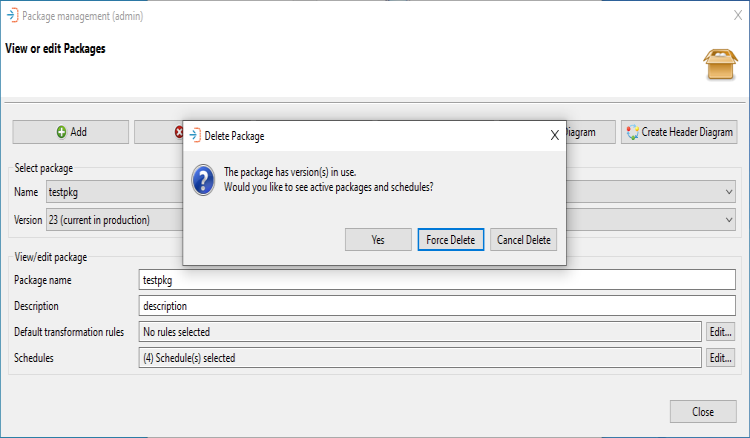

Selecting **Yes** displays the list of schedules used in active packages for cross-referencing:

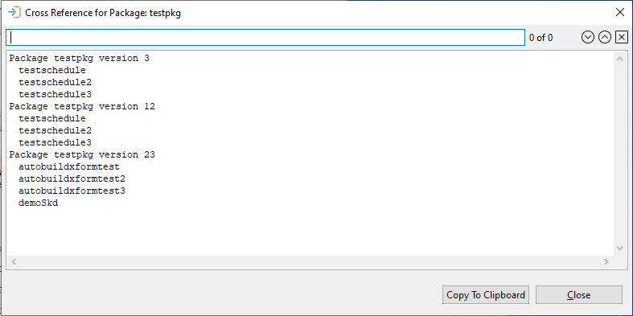

 Select **Close** to return to the previous confirmation window.

From the 2nd Confirmation Message window, select Force Delete to complete deleting the package. Select **Cancel Delete** to return to the View or Edit Packages window.

Once a package is deleted, the package entry in the Deployment Browser will no longer allow users to select "Rollback this deployment" or "Delete this deployment". These options will now be grayed out:

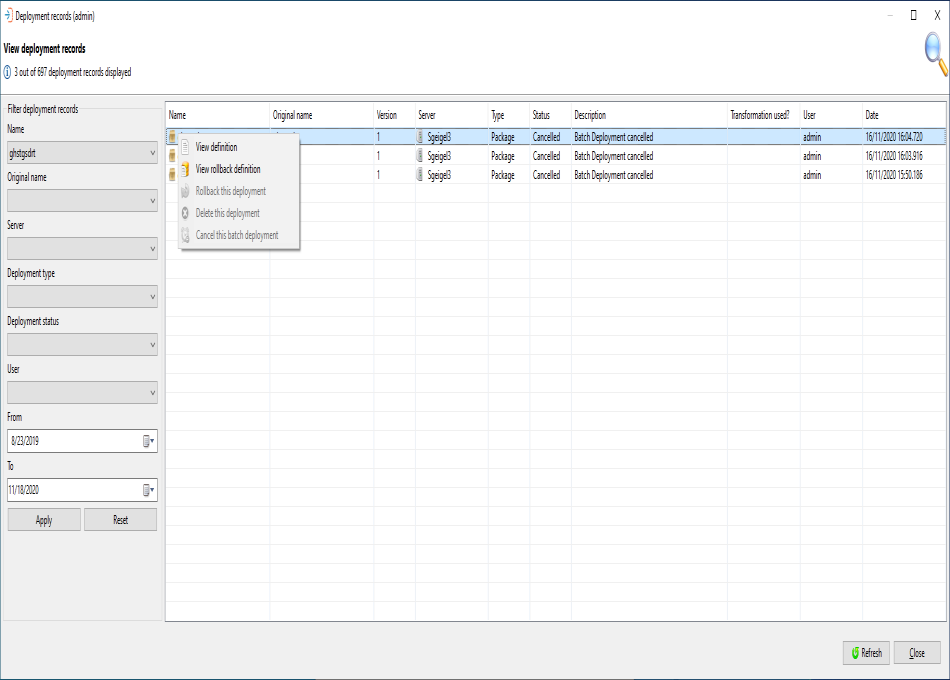

However, Batch deployments in progress may still be canceled in this window. If they are not canceled, the Batch Deploy job will fail when the Deploy CLI cannot find the package.

### Renaming a package

There are some circumstances in which users may need to rename packages. For example, changes to naming conventions would require package names to be updated. Packages may be renamed on the View or edit Packages dialog. On this screen, select a package from the **Name** list. The name and description of the package will be displayed, including Default transformation rules and Schedules that have been selected.

Rename the package by updating the **Package name** field and selecting the **Save** button.

:::note

If a package is renamed, all package versions will be renamed as well. Also, renaming a package does not create a new version unless there are other updates that have been made to the package.

:::
 

## View/Edit Package Section

This table contains descriptions of each field in the View/edit package section of the View or edit Packages dialog

### View/edit package section field descriptions

| Field | Description |
| ----- | ----------- |
| Package name | The name of the package - This must be a unique name within the System
| Description | An optional description of the package |
| Default transformation rules | Define a set of transformation rules that will always be applied when the Package is selected during deployment |
| Schedules | Select the schedules that form part of this package - A schedule can only belong to a single package |

When adding default transformation rules to the server, select the Edit button and the **Select one or more rules** dialog will appear.

The Select one or more rules dialog presents a screen and a **Select** capability that allows you to enter a text string in the **Filter** field to retrieve specific transformation rule records or use the displayed default value of asterisk (*) to retrieve all transformation rule records.
Once the text string has been entered select the **Refresh** button and the transformation rule records will be displayed. Subsequent requests will be added to the existing list. The **Clear** button can be used to reset the list of previously selected transformation rule records.

Transformation rules selected in the lower table, will remain in the upper selection screen after a reset.

To add a transformation rule, select the rule in the upper table and then select the **Include** button. To remove a transformation rule, select the rule in the lower table and select the **Remove** button.

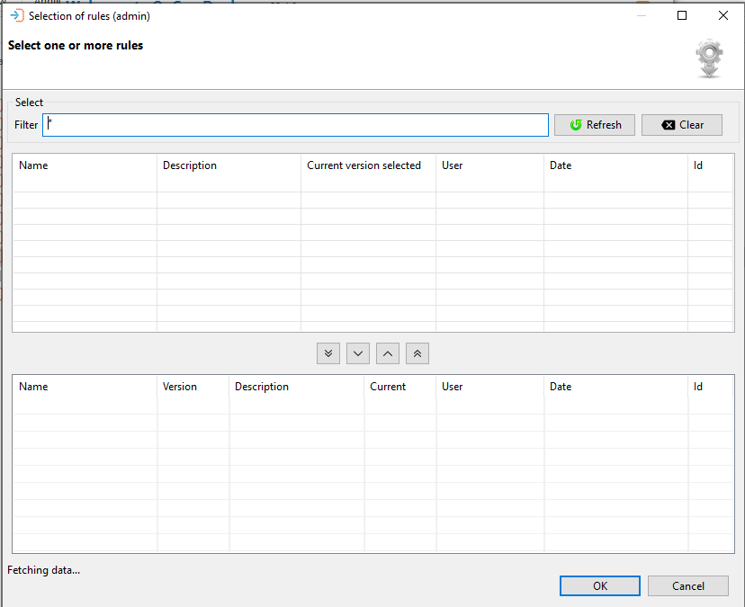

To view the transformation rule definitions, right-click the definition in the list (upper or lower tables) and select **View Definition** to view the JSON definition.

If transformation rules exist for a package deployment, but the server settings don't allow for transformation rules, a warning message stating "The selected server does not allow transformation rules: this deployment will fail" will appear.

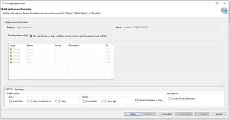

The package transformation rules will appear, but will not be selectable and the deployment cannot be completed. You may choose to go back to the previous screen, simulate a deployment, or cancel the current deployment. The Batch OpCon Deploy and OpCon Deploy buttons will be disabled.

To search for a value in the JSON, enter the required value in the search field above the definition and select a search direction using the forward or backward buttons. Selecting the X will remove the search result from the definition and the search field.

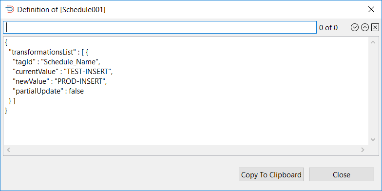

When adding default schedules to the package, select the Edit button and the **Select one or more Schedules** dialog will appear.

The Select one or more schedules dialog presents a screen and a **Select** capability that allows you to enter a text string in the **Filter** field to retrieve specific schedule records or use the displayed default value of asterisk (*) to retrieve all schedule records.
Once the text string has been entered select the **Refresh** button and the schedule records will be displayed. Subsequent requests will be added to the existing list. The **Clear** button can be used to reset the list of previously selected schedule records. 

Schedules selected in the lower table, will remain in the upper selection screen after a reset.

To add a schedule, select the schedule in the upper table and then select the **Include** button. To remove a schedule, select the schedule in the lower table and select the **Remove** button.

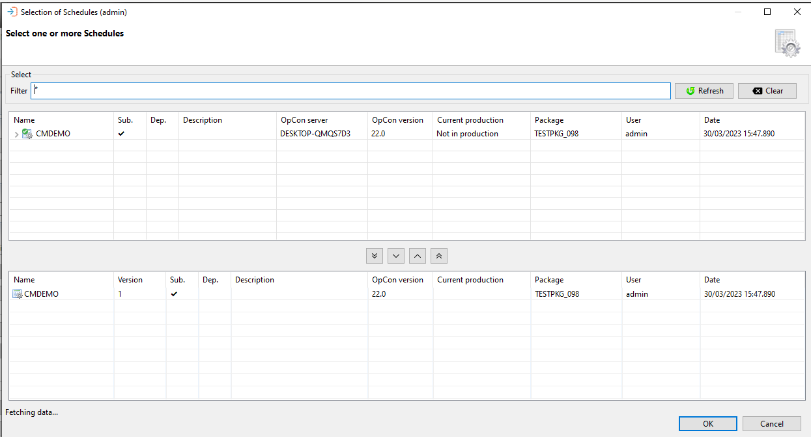

To view the Schedule definitions, right-click the definition in the list (upper or lower tables) and select **View Definition** to view the JSON definition.

To search for a value in the JSON, enter the required value in the search field above the definition and select a search direction using the forward or backward buttons. Selecting the X will remove the search result from the definition and the search field.

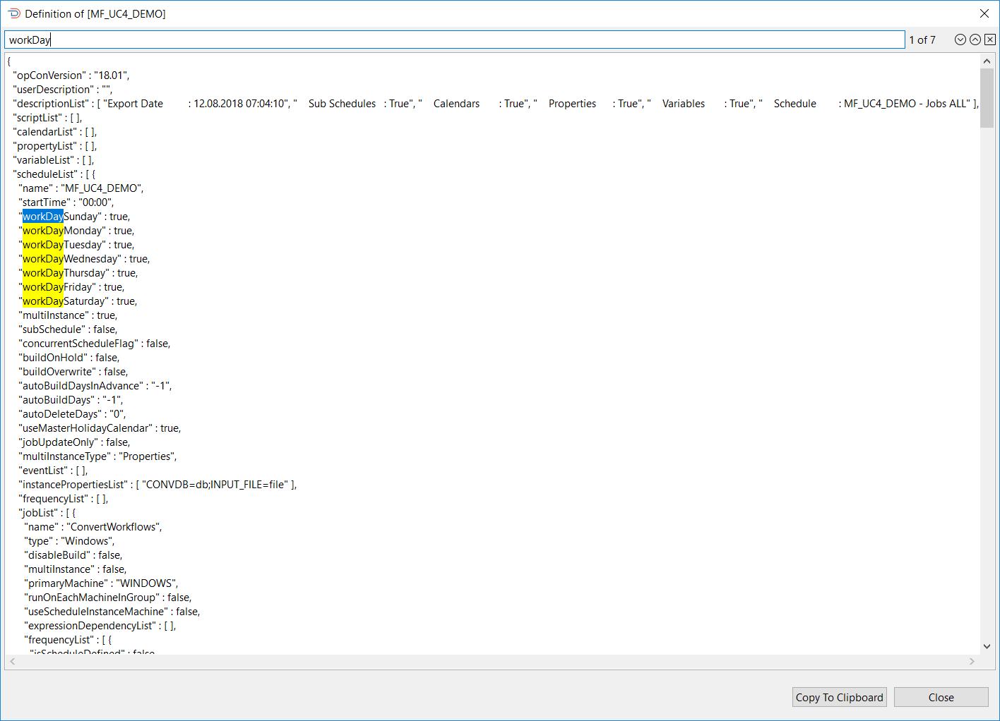

## Key terms

**Package** — a named group of schedule definitions that are deployed together as a single versioned unit.

**Schedule version** — the specific version of a schedule definition included in a package. Each schedule in a package is pinned to a version.

**Transformation rule** — a set of rules applied during deployment to adapt schedule definitions to a specific target environment.

## FAQs

**Can a schedule belong to more than one package?**

No. A schedule can only belong to a single package. The Schedules field description in the View/Edit Package section states this explicitly. Once a schedule is included in a package, it cannot be deployed independently to a production system either.

**What happens to deployments of a package after the package is deleted?**

After a package is deleted, the package entry in the Deployment Browser no longer allows users to select "Rollback this deployment" or "Delete this deployment" — those options are grayed out. Any batch deployments that are still in progress may be cancelled manually; if they are not cancelled, the Batch Deploy job will fail when the Deploy CLI cannot find the package.

**How do I update the schedule versions inside a package to pick up recent imports?**

Select the package in the View or Edit Packages dialog and then select the **Update Schedule Versions** button. Confirm the message that appears. This updates every schedule associated with the package to the latest version available in the Deploy database. If a schedule version is already the latest, no change is made. Select **Save** after the update to create a new package version that reflects the changes.

**Related topics:**

- [Schedules](schedules)
- [Deployments](deployments/deployments)
- [Transformation rules](transformations/transformation-rules)
