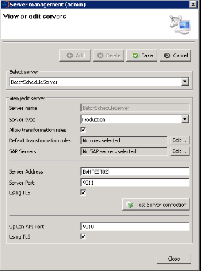

# Scheduled batch deployment

**Theme:** Configure  
**Who Is It For?** System Administrator

When performing a deployment using the OpCon Deploy client, there is a "Batch Deploy" option that can be used to schedule the deployment for a future date and time. After the batch deployment is scheduled, the batch deployment process begins, which involves the batch schedule server and the ```BATCH_DEPLOY``` schedule.

:::note "Prerequisites"
The batch schedule server and the ```BATCH_DEPLOY``` schedule must be set up correctly before a batch deployment can be scheduled. See [Batch deployment implementation](batch-deployment-implementation) for the full list of system requirements.
:::

## Batch schedule server

One of the OpCon systems that is participating in the OpCon Deploy environment should be designated as the "Batch Schedule Server". This server will be used to schedule batch deployments at the requested date and time, archive jobs, and perform database backups.

### Setting up the batch schedule server

To set up the batch schedule server, complete the following steps:

1. OpCon RestAPI
    * Must be installed using TLS with an internal certificate.
    * Start the services for OpCon RestAPI and OpCon Service Manager.
2. Install Solution Manager and start the service.
3. OpCon Deploy
    * Run the OpCon Deploy installer to install the Client and Server software. During install, configure the client to connect to the OpCon Deploy database.
    * Start the service OpCon Impex2 RestAPI.
4. Install a Windows agent if one is not available.
    * Start the service for the Windows agent and the associated JORS.
5. In OpCon Deploy, define the BatchScheduleServer if it does not already exist.
    * Log in to the OpCon Deploy client as a user with Admin privileges.
    * Add a server with the name "BatchScheduleServer" and point to the above identified batch schedule server:



## BATCH_DEPLOY Schedule

The ```BATCH_DEPLOY``` schedule must be available on the batch schedule server. To add it if not available, complete the following steps:

1. Import the schedule from the file. If OpCon Deploy is installed to the default location, the schedule definition file for ```BATCH_DEPLOY``` will be available at ```C:\ProgramData\OpConxps\Deploy\Client\templates\BATCH_DEPLOY.json```.
2. Create transformation rules to transform the schedule to match the batch schedule server environment.
    * Job: machine name. The current value is: ```BVHTEST02```. Replace this value with the name of a communicating Windows agent in the batch schedule server environment.
    * Property name. Global property “SMADeployPath” is for the OpCon Deploy install location where the ```Batch.SMAOpConDeployClient.exe``` application resides. The current value is: ```C:\Program Files\OpConxps\Deploy\Client\```. Replace this value with the actual location.
    * Windows user. The current value is: ```Use Service Account```. Replace this value with a desired user if needed.
3. Deploy the BATCH_DEPLOY schedule, with transformation rules, to the BatchScheduleServer.
4. Review the ```DEPLOY_SCHEDULE``` and ```DEPLOY_PACKAGE``` job to make sure the definitions match the server environment.
5. (*Optional*) Set auto build values for the schedule as required.

## Schedule the Batch Deploy

The scheduled batch deployment process begins with the selection of the schedule or package to be deployed, the selection of the target OpCon server, and then transformation rules, if required. Once the selection is completed, the “Batch deploy” button can be selected, which will open the Batch Deployment dialog. Provide the desired date and time for the deployment. Also enter the password for the OpCon Deploy user, if required.

## Batch deployment process

An overview of the Batch Deployment Process is displayed in the image below:


After the batch deployment is successfully scheduled, the ```BATCH_DEPLOY``` schedule is built into daily for the specified batch deploy date on the batch schedule server. OpCon Deploy then injects either a ```DEPLOY_SCHEDULE``` or ```DEPLOY_PACKAGE``` job into the ```BATCH_ DEPLOY``` schedule using the OpCon RestAPI.

If the job is injected correctly into the ```BATCH_DEPLOY``` schedule, a successful completion message is displayed and a record is inserted into the Deployment table, indicating that the schedule or package has been scheduled for future deployment.


## Exception handling

| Error or symptom | Meaning | How to fix it |
|---|---|---|
| Batch deployment scheduling fails and the deployment error message is displayed | The `BATCH_DEPLOY` schedule is not built into the daily on the batch schedule server for the requested deployment date, so the job cannot be injected | Confirm that auto build values are set for the `BATCH_DEPLOY` schedule; manually build the schedule into the daily for the required date if it is missing |
| The Batch Deployment dialog does not accept the submission or returns an authentication error | The password for the OpCon Deploy user was not entered in the Batch Deployment dialog | Enter the OpCon Deploy user password when prompted in the Batch Deployment dialog before selecting the submit or confirm action |
| The `DEPLOY_SCHEDULE` or `DEPLOY_PACKAGE` job fails at runtime with a file not found or path error | The `SMADeployPath` global property in the `BATCH_DEPLOY` schedule points to an incorrect directory and `Batch.SMAOpConDeployClient.exe` cannot be located | Update the `SMADeployPath` global property transformation rule with the actual installation path of the OpCon Deploy Client software on the Windows agent machine, then redeploy the `BATCH_DEPLOY` schedule |

## Key terms

**Batch Schedule Server** — the designated OpCon system within the Deploy environment that hosts the `BATCH_DEPLOY` schedule and is responsible for running scheduled deployments at the requested date and time; it requires a running OpCon RestAPI, Solution Manager, and a Windows agent with the OpCon Deploy Client installed.

**BATCH_DEPLOY schedule** — the OpCon schedule on the batch schedule server that must be present in the daily so that `DEPLOY_SCHEDULE` and `DEPLOY_PACKAGE` jobs can be injected into it by OpCon Deploy when a batch deployment is requested.

**Batch Deploy option** — the selection available in the OpCon Deploy client that, instead of deploying immediately, prompts for a future date, time, and user password, then injects the appropriate job into the `BATCH_DEPLOY` schedule on the batch schedule server to carry out the deployment at the specified time.

**Related topics:**

- [Batch deployment implementation](batch-deployment-implementation)
- [Batch processing](batch-processing)
