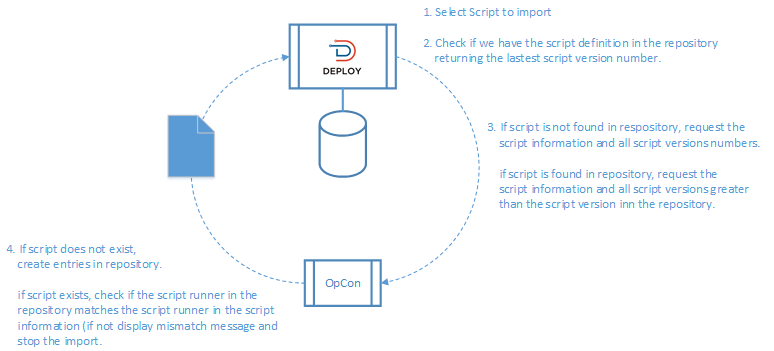
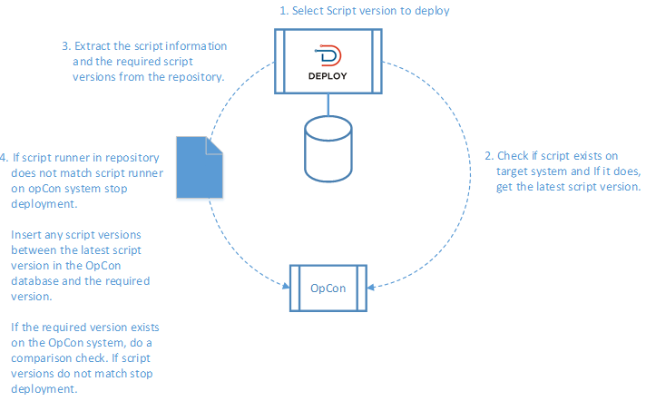

# Script Management

When using embedded scripts within the OpCon environment, the scripts are defined within OpCon script repository. Scripts in the OpCon script repository are versioned. Each OpCon system has its own script repository, which can lead to a script version having different version numbers on different OpCon systems unless extreme care is taken when exporting and importing script versions between OpCon systems.

The Script Management within OpCon Deploy acts as the central script repository for all script versions across all participating OpCon systems. This is done by checking that all script versions are present in the repository during the import process and then ensuring that all script versions are present on the OpCon system during the deployment process (e.g., when importing script version 7, it must be inserted into the repository as script version 7 and when deploying script version 7 to an OpCon system, it must be script version 7 on the target OpCon system.).

Scripts can be imported into the Central repository by selecting a specific script from a specific OpCon system or importing the scripts when definitions are discovered during schedule import. If a schedule contains tasks that include embedded jobs (currently, Windows and UNIX), the associated script version is included in the definitions and will ensure that the script information will be imported into the central repository.

## Import Process

During the import process, a check is made to see if the script exists in the OpCon Deploy repository.

* If the script exists, a check is made to ensure the script runner matches.
    * If the script runner does not match, the import is stopped.
    * If the script runner matches, a check is made to see if the script version exists.
        * If the script version does not exist, get the latest version number of the script from the repository and extract all versions from the OpCon system between the latest version in the repository and the new script version (e.g., if the script version being imported is 6 and the latest version in the repository is 3, get versions 4 and 5 from the OpCon system as these versions must exist on the OpCon system).
* If the script does not exist, get all versions of the script from the OpCon system and insert them into the repository (e.g. if we have a script version of 3, then the script information is created; versions 1 and 2 are extracted from the OpCon system and versions 1,2, and 3 are inserted into the OpCon Deploy repository).

## Deployment Process

During the deployment process, a check is made to the target OpCon system to see if the script exists.

* If the script exists, a check is made to ensure that the script runner matches.
    * If the script runner does not match, the deployment is stopped.
    * If the script runner matches, a check is made to see if the script version exists.
        * If the script version exists, a match is done on the script version content. If the content does not match, the import is stopped.
        * If the script version does not exist, get the latest version number of the script from the OpCon system and extract all versions from the repository between the latest version on the OpCon system and the new script version (e.g., if the script version being deployed is 6 and the latest version on the OpCon system is 3, get versions 4 and 5 from the repository as these versions must exist in the repository).
* If the script does not exist, get all script versions of the script from the repository including the required version and deploy them into the OpCon system repository (e.g., if we have a script version of 3, then the script information is created; versions 1 and 2 are extracted from the repository and versions 1,2, and 3 are deployed to the OpCon system).

