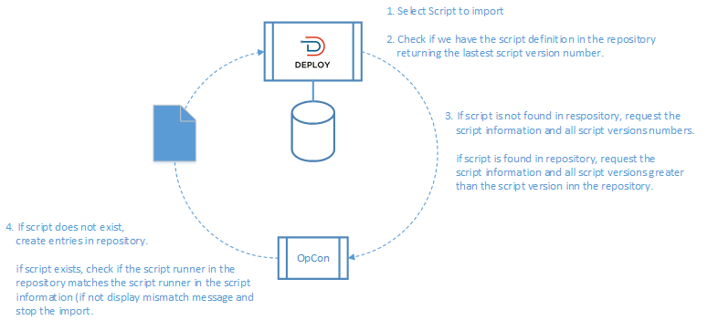
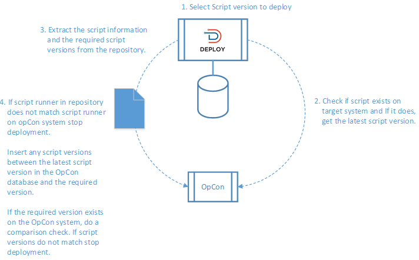

# Script management

**Theme:** Overview  
**Who Is It For?** Automation Engineer

## What is it?

OpCon Deploy acts as the central script repository for all script versions across every participating OpCon system. Without central management, the same script can end up with different version numbers on different systems, making controlled deployment unreliable. OpCon Deploy solves this by tracking every script version and ensuring that when a schedule containing an embedded script is imported or deployed, all required script versions are present and consistent on the target system.

## Import process

During the import process, a check is made to see if the script exists in the OpCon Deploy repository.

* If the script exists, a check is made to ensure the script runner matches
    * If the script runner does not match, the import is stopped
    * If the script runner matches, a check is made to see if the script version exists
        * If the script version does not exist, get the latest version number of the script from the repository and extract all versions from the OpCon system between the latest version in the repository and the new script version (e.g., if the script version being imported is 6 and the latest version in the repository is 3, get versions 4 and 5 from the OpCon system as these versions must exist on the OpCon system)
* If the script does not exist, get all versions of the script from the OpCon system and insert them into the repository (e.g. if we have a script version of 3, then the script information is created; versions 1 and 2 are extracted from the OpCon system and versions 1,2, and 3 are inserted into the OpCon Deploy repository)

## Deployment process

During the deployment process, a check is made to the target OpCon system to see if the script exists.

* If the script exists, a check is made to ensure that the script runner matches
    * If the script runner does not match, the deployment is stopped
    * If the script runner matches, a check is made to see if the script version exists
        * If the script version exists, a match is done on the script version content. If the content does not match, the import is stopped
        * If the script version does not exist, get the latest version number of the script from the OpCon system and extract all versions from the repository between the latest version on the OpCon system and the new script version (e.g., if the script version being deployed is 6 and the latest version on the OpCon system is 3, get versions 4 and 5 from the repository as these versions must exist in the repository)
* If the script does not exist, get all script versions of the script from the repository including the required version and deploy them into the OpCon system repository (e.g., if we have a script version of 3, then the script information is created; versions 1 and 2 are extracted from the repository and versions 1,2, and 3 are deployed to the OpCon system)

## Key terms

**Script repository** — the central store within OpCon Deploy that holds every version of every script across all participating OpCon systems, ensuring that script version numbers remain consistent regardless of which individual OpCon system was the origin of each version.

**Script version** — a numbered, immutable copy of a script's content as it existed at a specific point in time; OpCon Deploy requires that version numbers be identical on both the repository and every target OpCon system, so gaps in version sequences are filled automatically during import and deployment.

**Embedded script** — a Windows or UNIX/Linux script that is defined directly within an OpCon job definition rather than stored externally; when a schedule containing embedded script jobs is imported or deployed, OpCon Deploy automatically captures and propagates all required script versions alongside the schedule definition.

**Related topics:**

- [Scripts](scripts)
