# Scripts

**Theme:** Build  
**Who Is It For?** Automation Engineer

## What is it?

The Scripts functions support the capabilities required to import, view, and deploy script definitions. Before a script can be deployed to a target OpCon system, it must be registered with OpCon Deploy.

* Import scripts used by jobs in a schedule so all versions are available in the repository before deployment
* Deploy a specific script version directly to a target OpCon system
* Ensure the same script version number exists on all participating OpCon systems, preventing version mismatches
* Scripts referenced in an imported schedule are automatically captured during the schedule import process

## Import

The Import function is used to register a script definition with the OpCon Deploy system. During the import process, the script name is selected from a source OpCon system. A check is made to see if the script already exists in the repository and if it does, all script versions greater than the latest script version in the repository are extracted from the OpCon system and inserted into the repository. If the script does not exist in the repository, all script versions present on the OpCon system are extracted and inserted into the repository.

Scripts can also be inserted into the repository when a schedule is imported. If during the schedule import process, a script is encountered, a check is made to see if this version of the script already exists in the repository. If not, the version is added to the repository.

The import process is divided into two distinct phases with the first phase being the selection phase and the second phase the confirmation phase.

OpCon Deploy requires that each OpCon system participating in the OpCon Deploy environment requires a license. To enforce this, a check is made to determine if the requested system has a valid OpCon Deploy license. If the system does not have a valid license, the following message will be displayed:


## Import selection phase

:::note "Prerequisites"
The OpCon system to import from must be defined as a server in OpCon Deploy and must have a valid OpCon Deploy license. See [Servers](administration/servers).
:::

The import process begins with the selection of the OpCon system to import the script from. Following that, various dialogs will be presented leading you through the process.

To start the Import, select the Script Import function. The Script Import (Select a server) dialog appears and you will need to select, from the list, the OpCon system from which to import the script and then select the Next button. Only OpCon systems defined in the OpCon Deploy database will appear in the list.

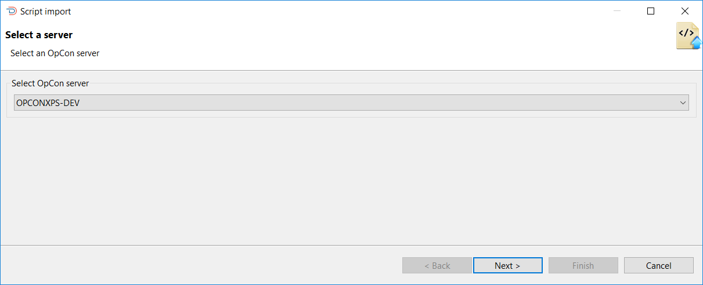

Once Next has been selected, the list of scripts will be retrieved from the chosen OpCon system and displayed in the Scripts list of the Script Import (Select one or more Scripts to import) dialog. Once the script list has been created, you can filter the script names on the list by entering a value in the Filter by Script name field. You can select multiple scripts to import from the source OpCon system by selecting the script names and then using the **>** button to move the script names to the right-hand list. Once script(s) has been selected, select the Next or Finish button.

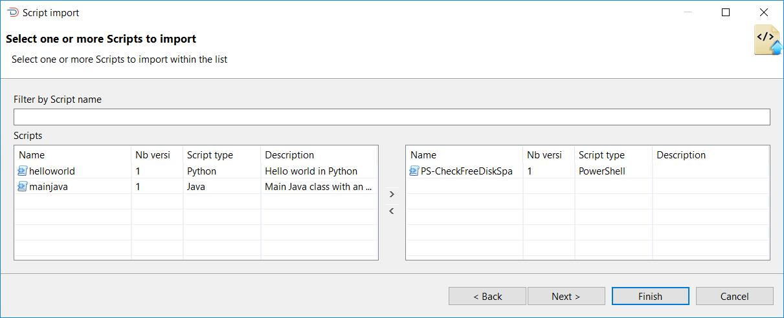

When importing scripts, it is not necessary to select a script version as all missing versions will be retrieved during the import process.

Once Next has been selected, the selected script(s) will be displayed in the Script Import (Summary) dialog. This provides a summary of your selections, allows a description to be added to the script records.

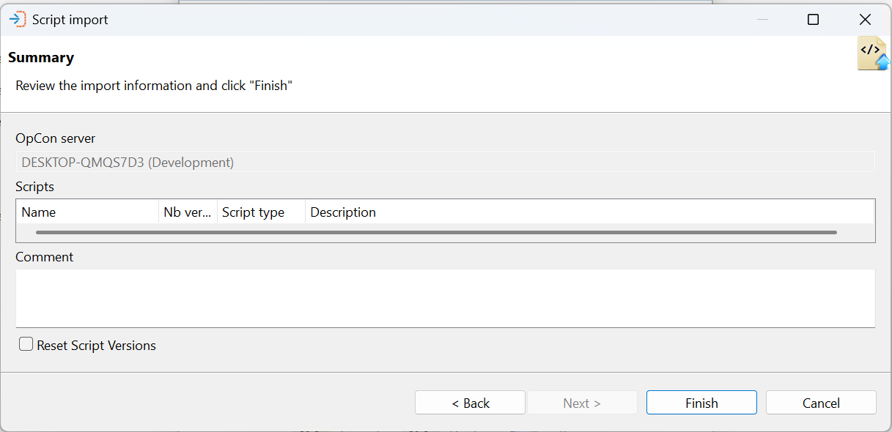

If the script(s) has been inserted successfully into the repository, you will get a success message indicating that the script has been inserted for each selected script.

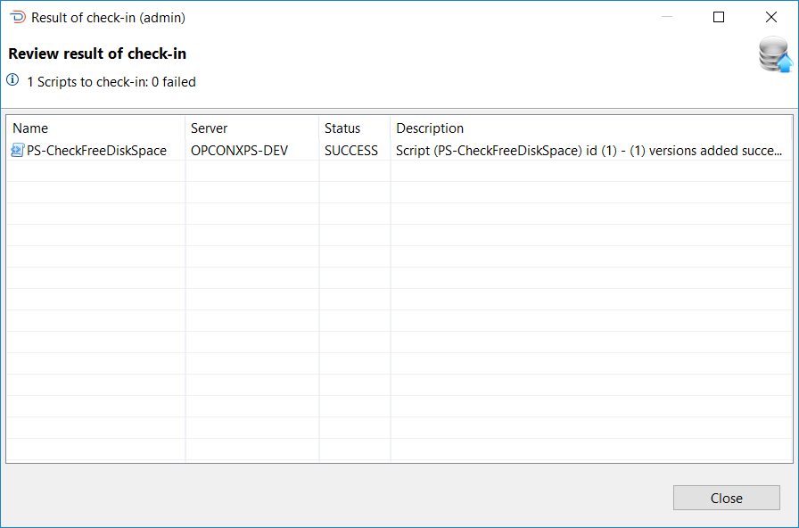

## Deploy

The OpCon Deploy process begins with the selection of the script version to deploy.

OpCon Deploy requires that each OpCon system participating in the OpCon Deploy environment requires a license. To enforce this, a check is made to determine if the requested system has a valid OpCon Deploy license. If the system does not have a valid license, the following message will be displayed:

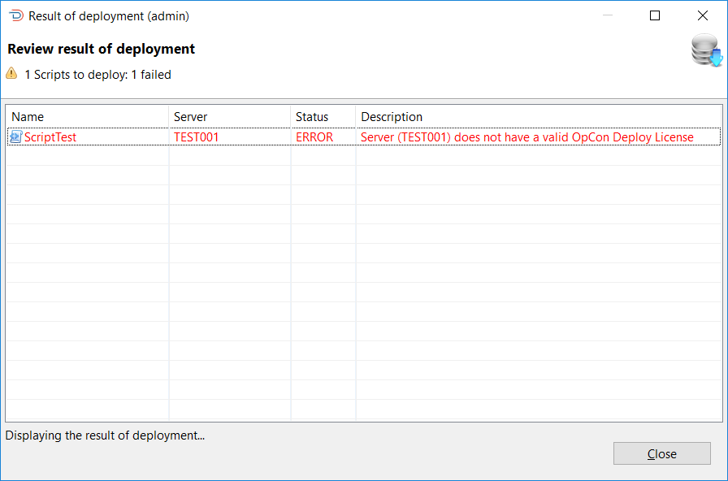

To start the OpCon Deploy process, select the Script OpCon Deploy function. The Script Deployment (Select Scripts) dialog appears and you will need to select a specific version to deploy. 

The Select Scripts dialog presents a screen and a **Select** capability that allows you to enter a text string in the **Filter** field to retrieve specific scripts records or use the displayed default value of asterisk (*) to retrieve all script records.
Once the text string has been entered select the **Refresh** button and the script information will be displayed. Subsequent requests will be added to the existing list. The **Clear** button can be used to reset the list of previously selected scripts. 

Scripts selected in the lower table, will remain in the upper selection screen after a reset.

Wildcards are not supported. The text entered in the **Filter** field is checked against the script name in the record — for example, entering `HP` returns all script records with that character sequence in the name.

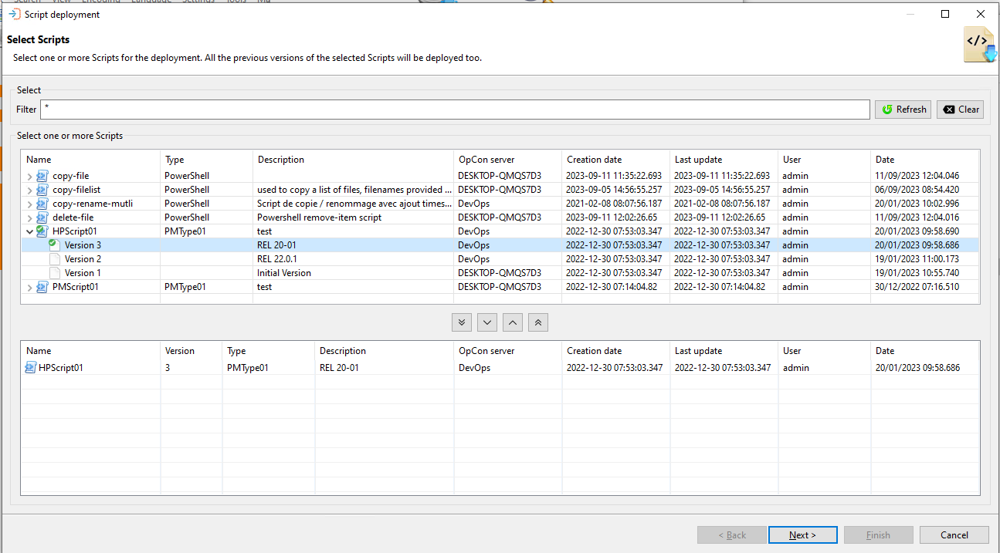

If the list of available versions is not visible, select the **>** indicator to the left of the script name and the list of versions will appear. To select a version select the version and then select the **Include** button.

Once the scripts have been selected, select the Next button to select the OpCon system to which to deploy the scripts.

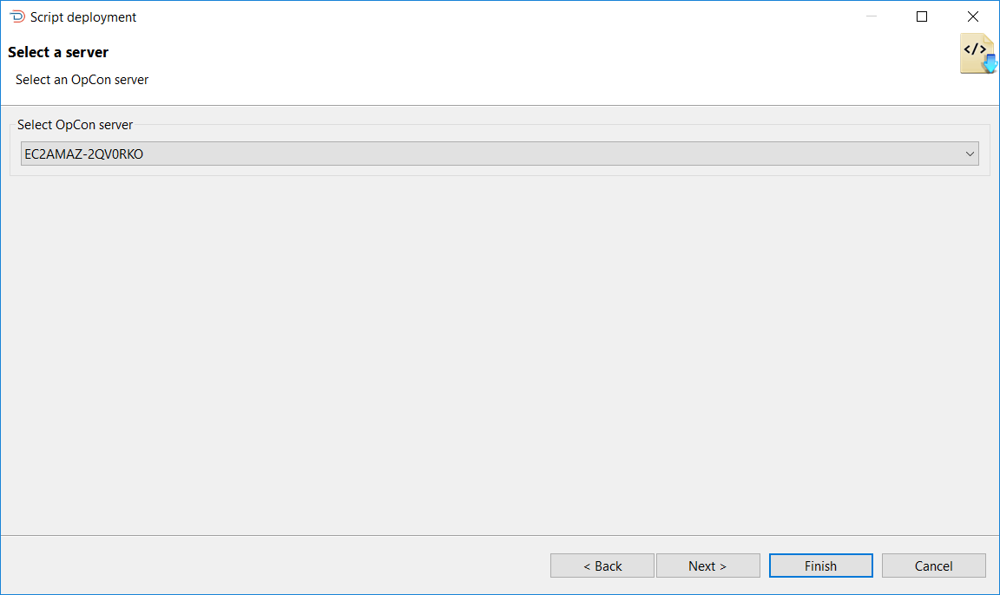

The target OpCon system can be selected from the list. Once the target system has been selected, select either the Next or Finish button. If the Next button is selected, the Script Deployment Summary dialog appears. It is possible to add a description in the comment field, which can be used to describe the reason for the deployment.

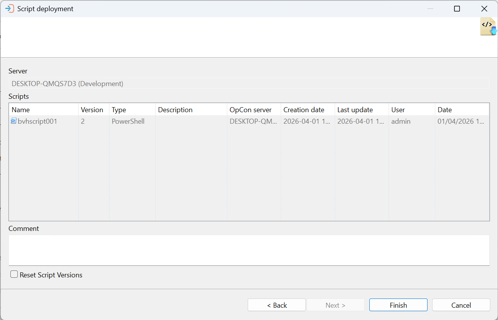

If the Script Deployment Summary dialog has been selected, select the Finish button to start the deployment process. When Finish is selected, a confirmation message will be displayed asking you to confirm that deployment must take place. When the deployment process finishes, one entry per script version appears in the result dialog. If the deployment produces an error condition, the result will be colored red.

If OpCon Deploy detects its copy of the repository has a different existing version from what it is importing from OpCon, the import will stop and an error message will indicating that the version history differs.

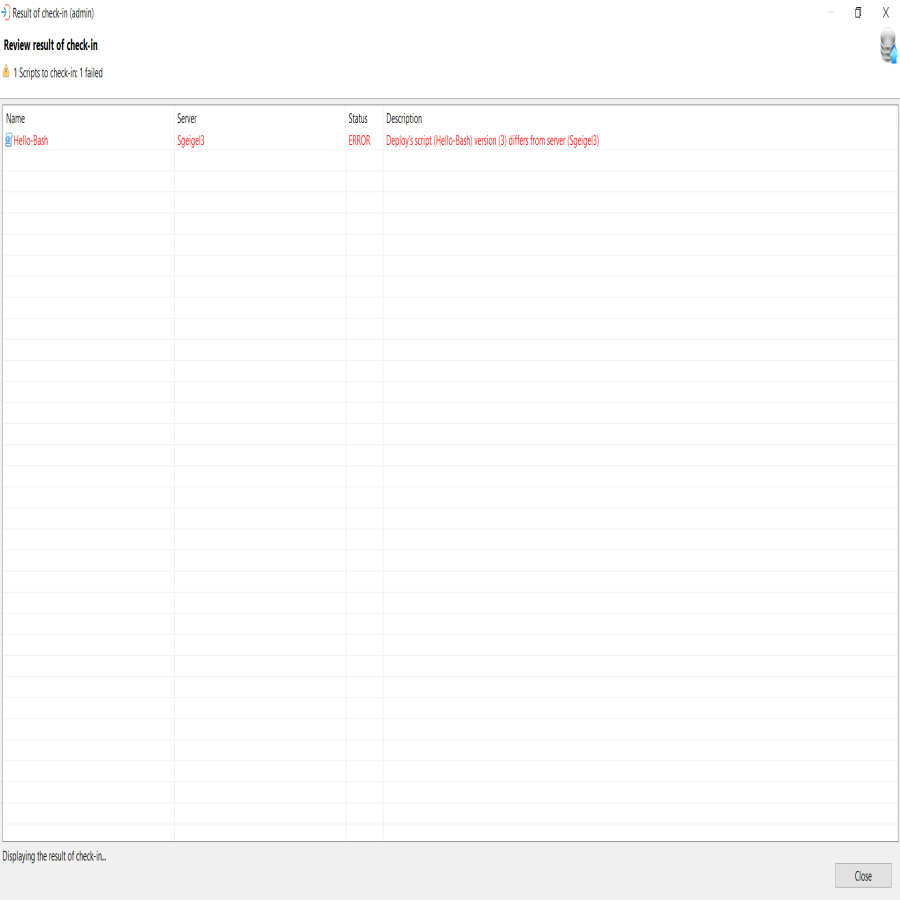

Select the **Close** button to return to the Script Deployment screen.

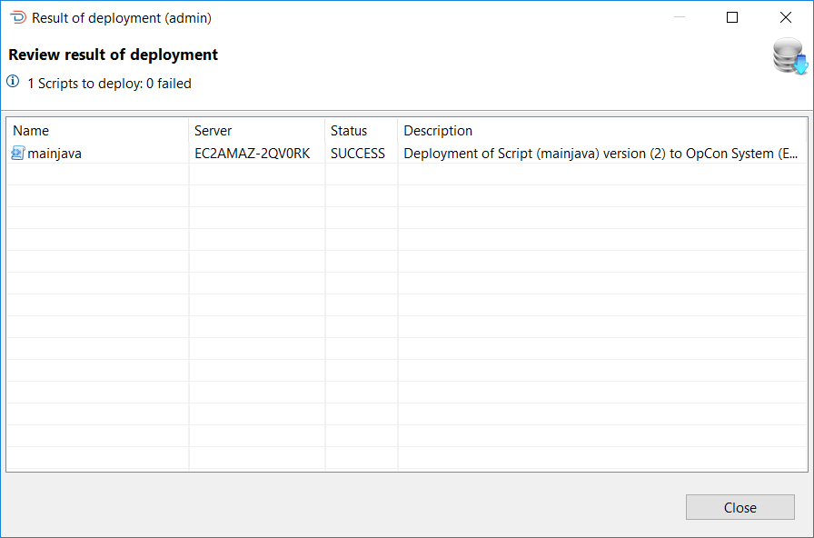

## Browse

This function provides the opportunity to display information about script definitions in the repository.

The Browse Imported Scripts dialog presents a screen and a **Select** capability that allows you to enter a text string in the **Filter** field to retrieve specific scripts records or use the displayed default value of asterisk (*) to retrieve all script records.
Once the text string has been entered select the **Refresh** button and the script information will be displayed. Subsequent requests will result in the new selection being displayed. 

Wildcards are not supported. The text entered in the **Filter** field is checked against the script name in the record — for example, entering `HP` returns all script records with that character sequence in the name.


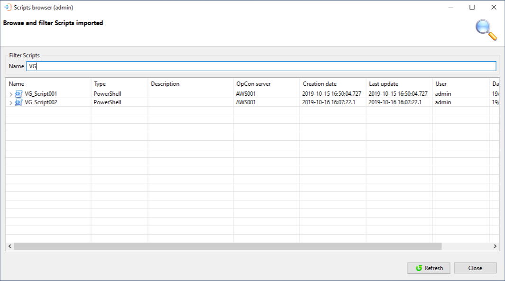

To update the list of scripts displayed in the Browse and filter Scripts imported window, Select the **Refresh** button, located in the bottom right corner of the window next to the **Close** button.

### Browse and filter scripts imported columns

| Column | Description |
| ------ | ----------- |
| Name | The name of the script |
| Type | The script type which the script is associated |
| Description | The description of the script |
| OpCon Server | The name of the OpCon server that the script was imported from |
| Creation Date	| The date the script was created on the OpCon system |
| Last Update | The date the script was updated on the OpCon system |
| User | The name of the user that performed the last action on the script repository definition |
| Date | A timestamp when the last action was performed |

The high-level entry in the table contains the name of the script and the type. To see a list of versions in the repository, select the > in front of the script name. This will then display a list of all versions present in the database. The version information contains the version number, the date when the version was created on the OpCon system, the Last Update time of the script on the OpCon system, the user who imported the script into the repository, and the date when this was completed.

To view the script definition, right-click the definition in the list and select the **View Script Content** button and ```Definition of Script [<name>] version <n>``` will appear.

To search for a value in the script, enter the required value in the search field above the definition and select a search direction using the forward or backward buttons. Selecting the X will remove the search result from the definition and the search field.

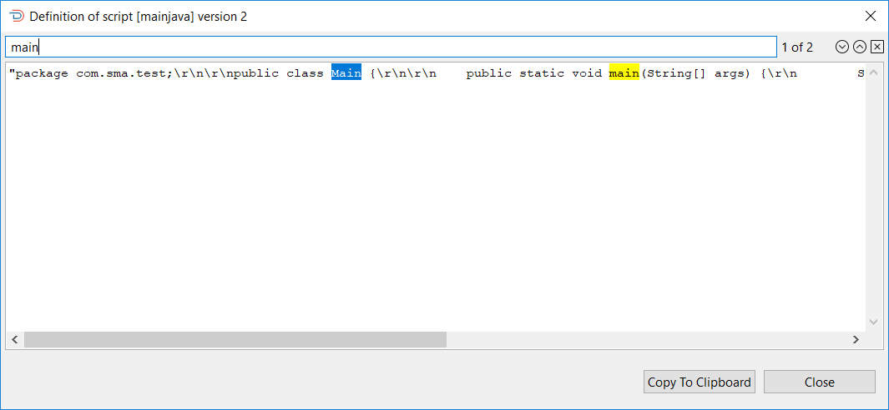


## Exception handling

| Error or symptom | Meaning | How to fix it |
|---|---|---|
| Invalid license message displayed | The source OpCon system does not have a valid OpCon Deploy license | Verify that the OpCon Deploy license is installed and active on the source OpCon system |
| Script runner mismatch — import stopped | The script runner defined for the script in the repository does not match the script runner on the source system | Ensure the same script runner is configured on both the repository and the source OpCon system |
| Script version content mismatch — deployment stopped | The content of the script version on the target system does not match the version in the repository | Investigate whether the script was modified directly on the target system; restore consistency before redeploying |

## Key terms

**Script** — a named, versioned piece of code stored in the OpCon script repository that can be embedded in job definitions.

**Script runner** — the execution engine configured to run a specific script type (for example, PowerShell, Python, Shell).

**Script version** — a numbered snapshot of a script's content. Version numbers must match across all OpCon systems participating in OpCon Deploy.

**Related topics:**

- [Script management](script-management)
- [Deployments](deployments/deployments)
