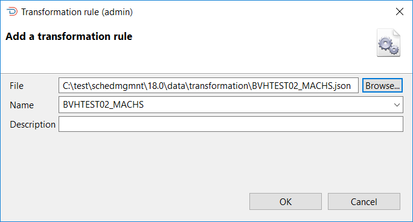
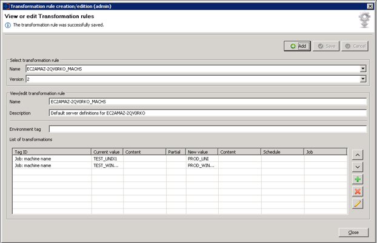
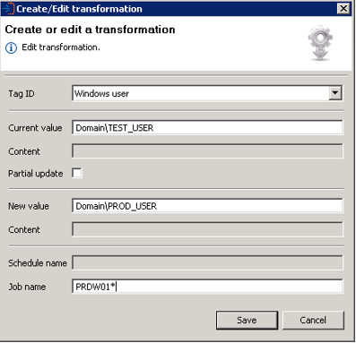
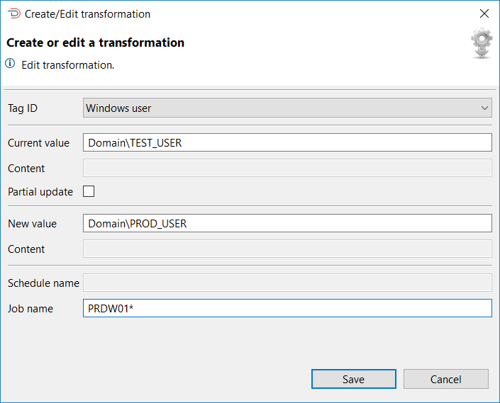
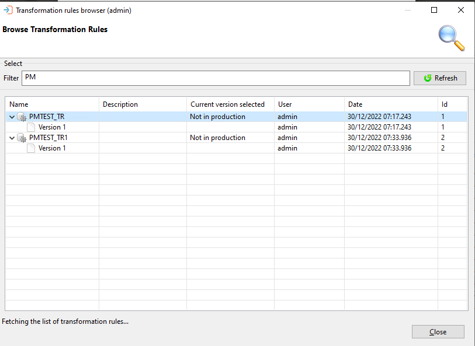
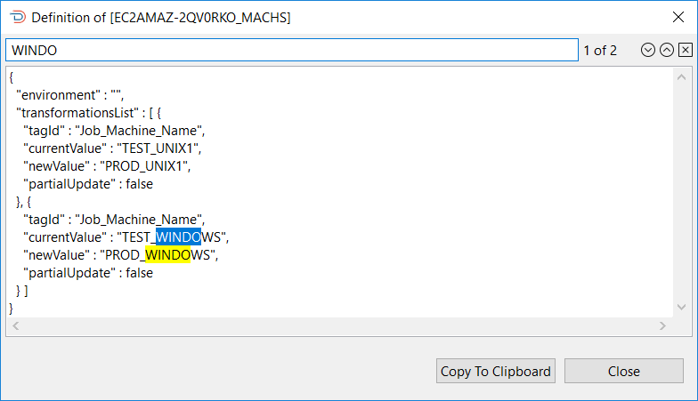
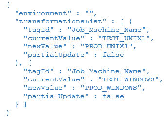
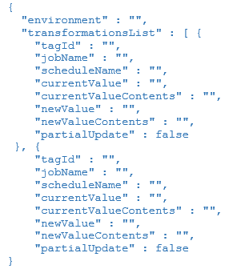

# Transformation rules

**Theme:** Configure  
**Who Is It For?** Automation Engineer, System Administrator

## What is it?

Transformation rules modify a schedule definition during deployment to match the specific requirements of a target OpCon system. Rules can be applied at three levels: server, package, and deployment.

* Transform machine names, batch users, and global properties so a single definition deploys correctly to any environment
* Define default rules at the server level so they are applied automatically to every deployment targeting that server
* Add package-level rules that apply every time a specific package is deployed
* Add deployment-level rules for one-time adjustments at the point of deployment
* Version and store rules in the repository for consistent reuse across multiple deployments

## Import file

* The Import File function is used to import a transformation rule into the central repository. When importing a rule, a unique name must be given to the rule or the name selected from the list of existing rules defined in the database. When importing a new file, the file name will be used as the unique name. An optional description can be entered describing the contents of the transformation file



### Add a Transformation Rule

* This next table describes each field displayed in the Add a transformation rule dialog. This dialog is used when adding a transformation rule to the central repository

| Field | Description |
| ----- | ----------- |
| Name | A unique name given to the rule. Either enter a unique name or select a name from the list |
| Description | An optional field that can be used to describe the contents of the rule |
| File | The full pathname to the file containing the Transformation Rule definitions |

## Create/Edit

* The Create/Edit function is used to create new transformation rules or modify existing transformation rules. When selected, the transformation rule editor opens

* Select the **Add** button to create a new transformation rule or select a transformation rule from the list to make one of the following changes to the rule:
    * Rename
    * Update Description
    * Update Environment Tag
    * Update List of Transformations

* When all changes have been completed, select the **Save** button to update the transformation rule. A new version is created each time the transformation rule is updated, with the exception of a rule rename. No new version is created if the only change to the transformation rule is a renaming



* A transformation rule contains a list of transformations, displayed at the lower part of the Transformation Rule Editor. Use the toolbar buttons on the right side of the list to make changes to the transformations:
    * Select the **Up** button to move the priority of the transformation higher
    * Select the **Down** button to move the priority of the transformation lower
    * Select the **Add** button to add a new transformation
    * Select the **Remove** button to remove an existing transformation
    * Select the **Edit** button to edit an existing transformation

* After selecting the **Add** or **Edit** button, the transformation editor opens. Define the transformation and select the **Save** button



* To change an existing rule, select the rule and the **Create or edit a transformation** dialog will appear. To change the Tag ID, select a new tag from the list. Change or add definitions, as required, and select Save to update the rule



* In the transformation rule editor, to create a new rule, select the **Add** button on the right-hand side. To remove a rule, select the **Remove** button on the right-hand side. When all changes have been completed, select Save to update the transformation rule and create the initial or new version

## Browse

* The Browse function provides the opportunity to display information about the transformation rule as well as the definitions associated with the rule

The Browse Transformation Rules dialog presents a screen and a **Select** capability that allows you to enter a text string in the **Filter** field to retrieve specific transformation rule records or use the displayed default value of asterisk (*) to retrieve all transformation rule records.
Once the text string has been entered select the **Refresh** button and the transformation rule information will be displayed. Subsequent requests will result in the new selection being displayed. 

Wildcards are not supported. The text entered in the **Filter** field is checked against the transformation rule name in the record — for example, entering `PM` returns all records with that character sequence in the name.



* To update the list of transformation rules displayed in this window, select the **Refresh** button

### Browse transformation rules

* This allows the information associated with a transformation rule to be displayed as well as the definitions associated with the transformation rule

* The Browse Transformation Rules dialog presents a list of the filtered transformation records. This next table describes the information displayed in the dialog

| Column | Description |
| ------ | ----------- |
| Name | The name of the transformation record |
| Description | The description entered when the transformation record was created |
| Current Version Selected | Indicates which version is in use |
| User | The user that performed the last action on the transformation rule record |
| Date | A timestamp of when the last action was performed |
| Id | The database record ID of the transformation rule |

* To view the transformation rule definitions, right-click the definition in the list and select **View Definition** to view the JSON definition

* To search for a value in the JSON, enter the required value in the search field above the definition and select a search direction using the forward or backward buttons. Selecting the X will remove the search result from the definition and the search field



## Defining transformation rules

* Defining transformation files consists of creating JSON files containing the transformation rules. A rule consists of a tag_id definition that defines the type of definition statement to transform, a current_value definition that defines the existing value in the definition, the new_value definition that contains the changes to be made to the definition, and the partial_update definition that indicates if the replacement is a partial update



* A template JSON file is available in the template directory after the installation is complete. This next table identifies the tags that define the transformation rule values that are currently supported

## Transformation rule definition tags and descriptions

### "environment" :""

* A special definition that defines a value that can be used to insert the same OpCon definition in a single target system by prefixed the value to schedule, resource, and threshold names (e.g., value of test results in ```test_<schedule name>```, ```test_<resource name>```, and ```test_<threshold name>```)

### "transformationList" :\[\{..\}\]

* A wrapper tag containing the list of transformation definitions

### "tagID" :""

* Defines the change tag id and consists of one of the following values:
    * Container_Sub_Schedule_Name
    * Department_Name
    * Event
    * Event_Related_User
    * File_Transfer_Destination_Machine
    * File_Transfer_Source_Machine
    * Frequency_Name
    * Frequency_Use_Existing_Definitions
    * IBMi_User_Id
    * IBMi_Call_Information
    * IBMi_Job_Description
    * IBMi_Job_Queue
    * IBMi_Library_Current
    * IBMi_Job_Queue_Priority
    * IBMi_Output_Queue
    * IBMi_Library_Init_List
    * IBMi_Message_Logging_Level
    * IBMi_Message_Logging_Severity
    * IBMi_Message_Logging_Text
    * IBMi_Inquiry_Message_Reply
    * Job_Instance_Property
    * Job_Machine_Group_Name
    * Job_Machine_Group_Name_to_Machine_Name
    * Job_Machine_Name
    * Job_Machine_Name_to_Machine_Group_Name
    * Job_Name
    * Job_Tag
    * MCP_Arguments
    * MCP_File_Title
    * MCP_Prerun_Arguments
    * MCP_Prerun_File_Title
    * MCP_User
    * Move_Schedule_Package
    * OS2200_Account
    * OS2200_Elementname
    * OS2200_Filename
    * OS2200_Project
    * OS2200_Qualifier
    * OS2200_Runid
    * OS2200_Userid
    * Property_Name
    * Resource_Name,
    * Schedule_Build_For_All_Machines_In_Group
    * Schedule_Instance_Property
    * Schedule_Name
    * Schedule_Named_Instance
    * Script_Name
    * Threshold_Name
    * SQL_DTExec_Server
    * SQL_DTExec_Package_Path
    * SQL_DTExec_User
    * SQL_Job_Server
    * SQL_Job_Jobname
    * SQL_Job_User
    * SQL_Script_Server
    * SQL_Script_Database
    * SQL_Script_User
    * SQL_Script_Filename
    * Unix_GroupId_UserId
    * Unix_Group_Id
    * Unix_User_Id
    * Unix_Script_Arguments
    * Unix_Start_Image
    * Unix_Parameter
    * Windows_User
    * Windows_Script_Arguments
    * Windows_Command_Line
    * Windows_Working_Directory
    * ZOS_Batch_User
    * ZOS_DDName
    * ZOS_Event_Name
    * ZOS_Member_Name
    * ZOS_Prerun_File_Dataset_Name
    * ZOS_Prerun_Job_Task_Name
    * ZOS_Prerun_System
    * ZOS_Prerun_REXX_Name
    * ZOS_Prerun_REXX_DDName

### "jobName" :""

* Optional tag that limits the change to job data associated with the specified job name. You can use the wildcard character (```*```) in the job name; the rule applies to all jobs starting with the characters preceding the wildcard character (e.g., JOB01*)
 
:::note

When a job_name value is defined, a transformation rule without a job_name will not affect the definition that has been associated with a transformation rule that includes a job_name tag.

:::

### "scheduleName" :""

* Optional tag that limits the change to schedule data associated with the specified schedule name. You can use the wildcard character (```*```) in the schedule name; the rule applies to all schedules starting with the characters preceding the wildcard character (e.g., SCHED01*)
 
:::note

When a schedule_name value is defined, a transformation rule without a schedule_name will not affect the definition that has been associated with a transformation rule that includes a schedule_name tag.

:::

### "currentValue" :""

* Defines the existing definition value to match

### "currentValueContents" :""

* Optional tag used when Schedule_Instance_Property, Job_Instance_Property, Property_Name and Resource_Name definition types are defined and defines the existing value of the property contents to match

### "newValue" :""

* Defines the value to replace in the definition if a match occurs

### newValueContents" :""

* Optional tag used when Schedule_Instance_Property, Job_Instance_Property, Property_Name and Resource_Name definition types used when Schedule_Instance_property changes are defined and defines the value to replace in the definition if a match occurs

### "partialUpdate" :false

* Indicates if this modification is a partial update or a full replacement

Values are true for partial update or false for full replacement.

:::note

Care should be taken when using partial updates across multiple schedules as the check is applied to all definitions of the same type.

:::

* This next graphic shows the transformation_template.json file. If tags are not needed, they can be omitted or defined as “”




## Key terms

**Transformation rule** — a named, versioned set of tag-based rules stored in the central repository that modify a schedule definition during deployment.

**Tag** — a specific instruction within a transformation rule that identifies what to change in the schedule definition (for example, machine name, batch user, or global property value).

**Server transformation** — a default transformation rule assigned to a server definition that is applied automatically to every deployment targeting that server.

**Package transformation** — a default transformation rule assigned to a package definition that is applied automatically every time that package is deployed.

## Exception handling

| Error or symptom | Meaning | How to fix it |
|---|---|---|
| Import of a rule file fails with a format or validation error | The JSON file does not conform to the expected transformation rule schema (for example, a required tag such as `tagID`, `currentValue`, or `newValue` is missing or malformed) | Open the file and verify it matches the structure shown in the transformation_template.json file; ensure all required tags are present and values are valid JSON strings |
| Import is accepted but no new version is created | The only change between the imported file and the existing rule was a rename — OpCon Deploy does not create a new version for rename-only changes | Make at least one substantive change to a transformation definition before importing if a new version is required |
| Deployment fails when transformation rules are selected for a server | The target server has **Allow Transformation Rules** cleared and the global **Fail if Transformation Rules Present and Transformation Disabled** setting is enabled | Either enable **Allow Transformation Rules** on the target server definition, remove the transformation rules from the deployment, or disable the global fail rule in Settings |

## FAQs

**Do transformation rules apply to every job in a schedule, or can they be limited to specific jobs?**

By default, a transformation rule applies to all matching definitions in the schedule. However, using the optional `jobName` tag limits the rule to data associated with the specified job. The wildcard character (`*`) can be used so that the rule applies to all jobs whose names start with the characters before the wildcard. Note that when a `jobName` value is defined, a transformation rule that does not include a `jobName` tag will not affect definitions already scoped to a job name.

**What does "partial update" mean in a transformation rule?**

The `partialUpdate` field controls whether a matched value is fully replaced or only partially updated. When set to `false`, the entire value is replaced with the `newValue`. When set to `true`, only the matched portion of the value is replaced. Care should be taken when using partial updates across multiple schedules because the check is applied to all definitions of the same type.

**How do I ensure the same transformation rules are applied to every deployment targeting a specific server without having to select them each time?**

Add the rules as default transformation rules on the server definition. In the View or edit servers dialog, select the **Edit** button next to Default Transformation Rules and add the desired rules. These server-level rules are then applied automatically to every deployment targeting that server. They run first, before any package-level or deployment-level rules.

**Related topics:**

- [Transformation tag definitions](transformation-tag-definitions)
- [Transformations — special definitions](transformations-special-definitions)
- [Deployments](../deployments/deployments)
