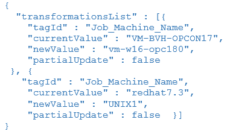
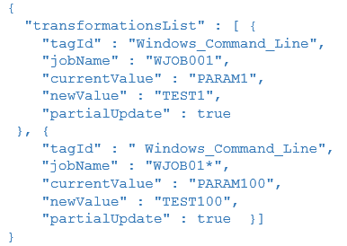
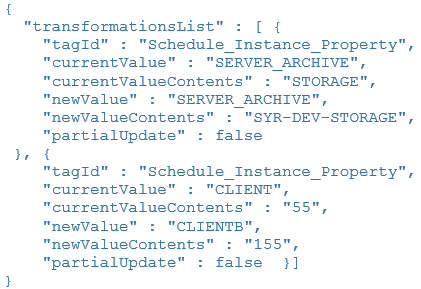
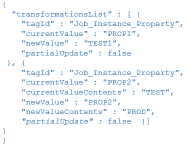

# Transformation tag examples

**Theme:** Configure  
**Who Is It For?** Automation Engineer

* This first figure is an example of transformation definitions used as default transformation rules to remap machine names when deploying schedules to an OpCon system

* This second figure shows how job name matching can be used. In the first rule, the rule will only be applied if the job name is equal to WJOB001 and in the second rule, the rule will be applied to all job names starting with the value JOB01

* This third figure shows how schedule instance properties can be transformed. In the first part, the schedule instance property value STORAGE of schedule SCHEDULE001 is transformed from STORAGE to SYR-DEV-STORAGE. In the second part, the name of the schedule instance property CLIENT will be transformed to CLIENTB and the contents of schedule instance property 55 of schedule SCHEDULE001 is transformed from 55 to 155

* This fourth figure shows how job instance properties can be transformed. In the first part, the job instance property name PROP1 of job WJOB001 is transformed from PROP1 to TEST1. In the second part, the contents of job instance property PROP2 of job WJOB055 is transformed from TEST to PROD

## Key terms

**Tag ID** — the identifier for a specific transformation tag type, such as `Machine_Name` or `Job_Name`, that determines which field in the schedule definition is targeted when the rule is evaluated during deployment; each figure in this page illustrates a different tag ID and how its match and replacement values are configured.

**Schedule instance property** — a named property value associated with a specific schedule instance that can be targeted for transformation, allowing both the property name and its content value to be remapped to environment-specific values during deployment without altering the stored repository definition.

**Partial update** — a transformation option that allows a rule to match a substring within a field value rather than requiring an exact full-field match, enabling patterns such as job name prefixes (for example, `JOB01*`) to target multiple jobs with a single rule.

**Related topics:**

- [Transformation rules](transformation-rules)
- [Transformation tag definitions](transformation-tag-definitions)
