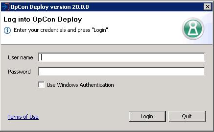
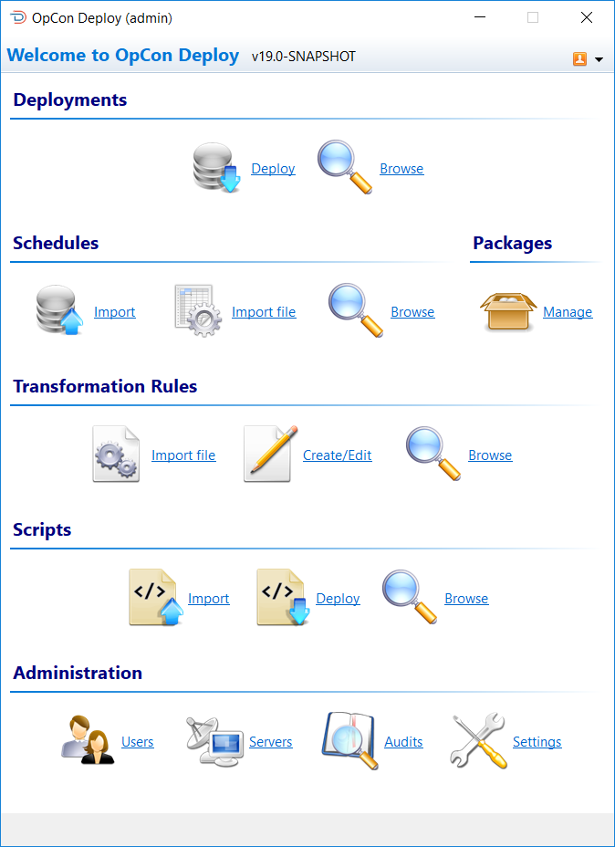
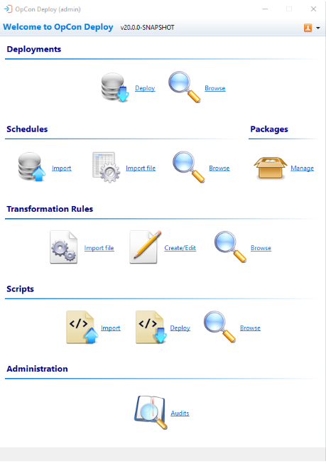

# User Interface

When starting the client software, the user must log in to gain access to the application by entering an appropriate user code and password. After installation, a default Administration user Admin with a password of admin can be used to access the SMA OpCon Deploy database initially. The password of the Admin user should then be changed.

OpCon Deploy supports users logging in to the application using Windows Authentication. To login to OpCon Deploy as the current Windows user, select the Use Windows Authentication checkbox. If the checkbox is selected, no user name or password is required.

Once the user has logged into the application, the user interface is displayed, allowing the user to select the required function.

If the user is not defined with the ADMINISTRATION role, the Administration section of the user interface will not be available.

However, non-Administration users who have been granted read-only access to view the Audit logs will have the Audits button enabled and centered in the Administration section of the splash screen. Non-Admin users with access to the Audit logs will not be able to use any other administrative features and those icons will not be displayed.

For more information on Viewing Audit Messages, refer to [Administration](administration/users).

## Logoff Menu

The top right corner of the user interface includes a logout menu. This menu allows the user to exit the application, log off from OpCon Deploy or change passwords.

Menu Actions

| Action | Function |
| ------ | -------- |
| Change OpCon Deploy Password | Users can change their OpCon Deploy password by selecting this action - The user will be required to enter their current OpCon Deploy password, and then a new OpCon Deploy password twice (Enter the new password and confirm) |
| Change OpCon Password	| Users can change their OpCon password by selecting this action - The user will be required to enter their current OpCon password, and then a new OpCon password twice (Enter the new password and confirm) |
| Logoff | Selecting this function will log off the user from the OpCon Deploy application - The user will then need to confirm the selection |
| Exit | Selecting the Exit function will terminate the OpCon Deployapplication - Once Exit is selected, the user will then need to confirm the selection |

## User Interface Functions

The user interface supports the functions identified in this section.

### Deployments

| Action | Function |
| ------ | -------- |
| Deploy | 	Selects a package or schedule and transformation rules and deploys this to the selected OpCon system | 
| Browse | 	Provides a list of deployments defined in the central repository (can also be used to display the deployed JSON definition, the backup JSON definition, or perform the rollback function) | 

### Schedules

| Action | Function |
| ------ | -------- |
| Import |	Selects a schedule from an OpCon system and imports this into the central repository |
Import file	| Imports a defined schedule definition file into the central repository |
Browse | Provides a list of schedules and versions defined in the central repository (can also be used to display the stored JSON definition) |

### Packages

| Action | Function |
| ------ | -------- |
| Manage | Creates a package in the repository, allocating schedules and transformation rules |

### Transformation Rules

| Action | Function |
| ------ | -------- |
| Import file | Imports a defined transformation rules file into the central repository |
| Create/Edit | Creates a new transformation file or edits an existing transformation file |
| Browse | Provides a list of transformation rules and versions defined in the central repository (can also be used to display the stored JSON definition) |

### Scripts

| Action | Function |
| ------ | -------- |
| Import | Imports selected scripts into the central repository |
| Deploy | Deploys the selected script to the target system |
| Browse | Provides a list of scripts and versions defined in the central repository (can also be used to display the stored definition) |

### Administration

| Action | Function |
| ------ | -------- |
| Users | Provides management of OpCon Deploy users |
Server | Provides management of OpCon Deploy Servers |
Audit | Provides query capabilities to the Audit table |
Settings | Provides configuration for the Global Rule settings |