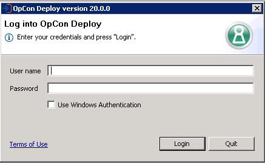
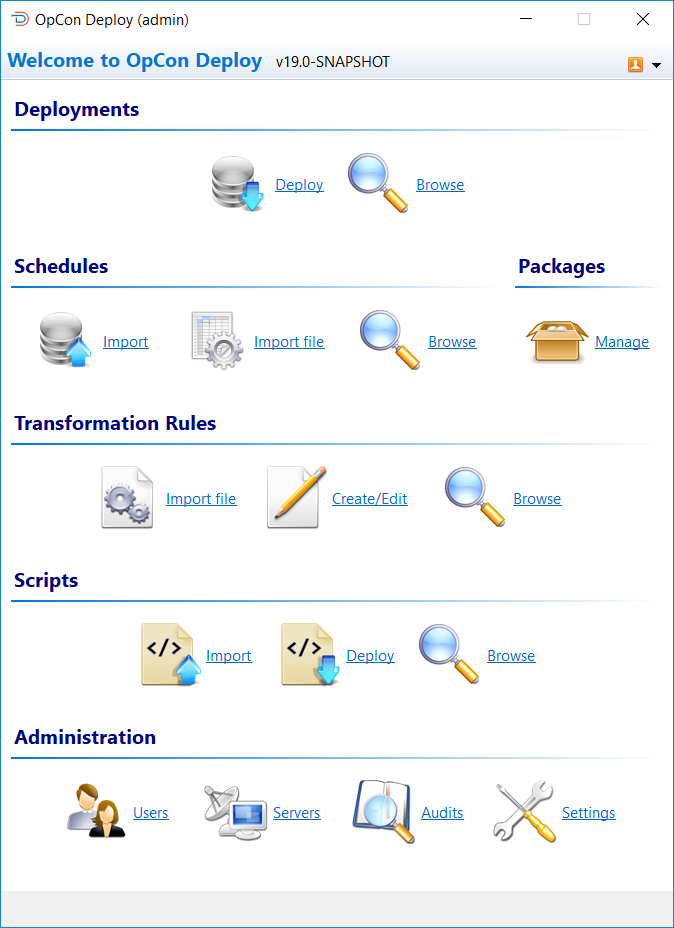
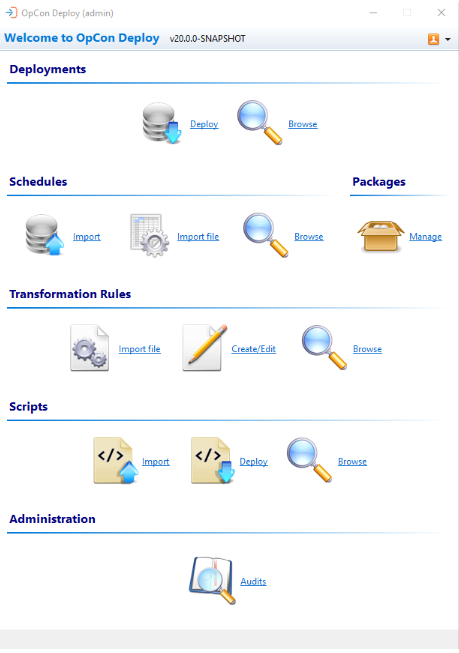

# User interface

**Theme:** Overview  
**Who Is It For?** Automation Engineer, Operations Staff

When starting the client software, you must log in to gain access to the application by entering an appropriate user code and password. After installation, a default Administration user Admin with a preset initial password (contact SMA support for needed password information) can be used to access the SMA OpCon Deploy database initially. The initial password should be changed after login.

OpCon Deploy supports users logging in to the application using Windows Authentication. To log in to OpCon Deploy as the current Windows user, select the **Use Windows Authentication** option. If the option is selected, no user name or password is required.

Once you have logged into the application, the user interface is displayed, allowing you to select the required function.

If you are not assigned the ADMINISTRATION role, the Administration section of the user interface will not be available.

However, non-Administration users who have been granted read-only access to view the Audit logs will have the Audits button enabled and centered in the Administration section of the splash screen. Non-Admin users with access to the Audit logs will not be able to use any other administrative features and those buttons will not be displayed.

For more information, see [Users](administration/users).

## Logoff menu

The top right corner of the user interface includes a logout menu. This menu allows you to exit the application, log off from OpCon Deploy, or change passwords.

Menu Actions

| Action | Function |
| ------ | -------- |
| Change OpCon Deploy Password | Users can change their OpCon Deploy password by selecting this action - You will be required to enter your current OpCon Deploy password, and then a new OpCon Deploy password twice (Enter the new password and confirm) |
| Change OpCon Password	| Users can change their OpCon password by selecting this action - You will be required to enter your current OpCon password, and then a new OpCon password twice (Enter the new password and confirm) |
| Logoff | Logs you off from OpCon Deploy. Confirmation required. |
| Exit | Closes the OpCon Deploy application. Confirmation required. |

## User interface functions

The user interface supports the functions identified in this section.

### Deployments

| Action | Function |
| ------ | -------- |
| Deploy | 	Selects a package or schedule and transformation rules and deploys this to the selected OpCon system | 
| Browse | 	Provides a list of deployments defined in the central repository (can also be used to display the deployed JSON definition, the backup JSON definition, or perform the rollback function) | 

### Schedules

| Action | Function |
| ------ | -------- |
| Import |	Selects a schedule from an OpCon system and imports this into the central repository |
| Import file | Imports a defined schedule definition file into the central repository |
| Browse | Provides a list of schedules and versions defined in the central repository (can also be used to display the stored JSON definition) |

### Packages

| Action | Function |
| ------ | -------- |
| Manage | Creates a package in the repository, allocating schedules and transformation rules |

### Transformation rules

| Action | Function |
| ------ | -------- |
| Import file | Imports a defined transformation rules file into the central repository |
| Create/Edit | Creates a new transformation file or edits an existing transformation file |
| Browse | Provides a list of transformation rules and versions defined in the central repository (can also be used to display the stored JSON definition) |

### Scripts

| Action | Function |
| ------ | -------- |
| Import | Imports selected scripts into the central repository |
| Deploy | Deploys the selected script to the target system |
| Browse | Provides a list of scripts and versions defined in the central repository (can also be used to display the stored definition) |

### Administration

| Action | Function |
| ------ | -------- |
| Users | Provides management of OpCon Deploy users |
| Server | Provides management of OpCon Deploy Servers |
| Audit | Provides query capabilities to the Audit table |
| Settings | Provides configuration for the Global Rule settings |

## Exception handling

| Error or symptom | Meaning | How to fix it |
|---|---|---|
| Login fails after entering user name and password | The user name or password supplied is incorrect, or the user does not exist in the OpCon Deploy database | Re-enter the correct credentials; if the initial Admin password has not yet been changed, contact SMA Support for the preset password |
| Access to a connected OpCon system is denied after login | The OpCon license for the connected system is invalid or has expired, preventing Deploy from interacting with it | Verify the OpCon license on the target system and contact SMA Support if the license needs to be renewed or updated |
| Session unexpectedly ends or functions become unavailable mid-session | The session has expired or the connection to the OpCon Deploy database has been lost | Log off and log back in to re-establish the session; if the problem persists, confirm that the OpCon Deploy database service is running and reachable |

**Related topics:**

- [Getting started](getting-started)
- [Users](administration/users)
